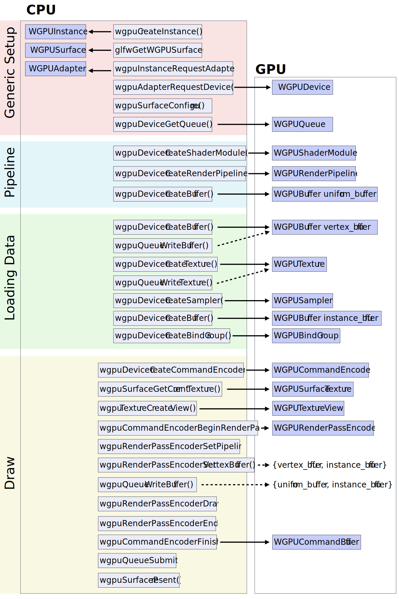

# IllEngine

In this class you will make your own game engine from scratch.

## Platform setup

The first thing we need is a compiler and build system. In this class, we will use [CMake](https://cmake.org/) as our build system. CMake is a popular, cross-platform build system. [Modern CMake](https://cliutils.gitlab.io/modern-cmake/) is actually pretty nice and worth learning. (We'll avoid the older, gross bits as much as possible.)
With CMake, we can use [FetchContent](https://web.archive.org/web/20220211151524/https://bewagner.net/programming/2020/05/02/cmake-fetchcontent/) as a sort of distributed package manager.

To install CMake:
* On Windows, you can download the CMake installer from the [official website](https://cmake.org/). You should also install the [C++ CMake tools for Windows as part of Visual Studio](https://learn.microsoft.com/en-us/cpp/build/cmake-projects-in-visual-studio). Then you can open a folder with a `CMakeLists.txt` in Visual Studio directly instead of running any of the command line commands.
* On macOS, you can use [Homebrew](https://brew.sh/): `brew install cmake`.
* On Linux, use your distribution's package manager.

You also need a compiler:
* On macOS, you should install `Xcode` via the `App Store`.
* On Windows, install Visual Studio.
* On Linux, install gcc or clang.

One you have a compiler and `cmake` installed, we are ready to begin.

> 🤖: Previous versions of this guide used [`xmake`](https://xmake.io/) as the build system. It has a lot going for it, like a clean language and built-in package manager. However, it's esoteric, so I switched this year's guide to the standard CMake. You can see the previous instructions and even try xmake by switching to the 2023 branch of this repository.

## Making a project

Create a new directory. Since we're making a "little engine", I called mine `illengine` (🤷).
Create a file `CMakeLists.txt` and put the following inside:

```
cmake_minimum_required(VERSION 3.14...3.30)
project(
    illengine # Name this whatever you want
    LANGUAGES CXX C
)

add_executable( helloworld demo/helloworld.cpp )
set_target_properties( helloworld PROPERTIES CXX_STANDARD 20 )
```

This declares that we require a relatively recent version of CMake, our project's name (choose something other than `illengine`), and that we'll be using C++ and C.
It also declares a target program named `helloworld`.
We want to use the C++20 standard. ([This](https://github.com/mortennobel/cpp-cheatsheet) is a pretty good modern C++ cheat sheet.)
This Hello, World! program will verify that your environment is working correctly.
Let's put the program in a `demo` directory. Create `demo/helloworld.cpp` and put the most basic C++ program inside:

```c++
#include <iostream>

int main( int argc, const char* argv[] ) {
    std::cout << "Hello, World!\n";
    return 0;
}
```

> 🤖: Behind the scenes, CMake is a build system generator. It can output Makefiles, Visual Studio Solutions, Xcode project files, etc. Some IDE's like Visual Studio [open `CMakeLists.txt` directly](https://learn.microsoft.com/en-us/cpp/build/cmake-projects-in-visual-studio). I will describe using `cmake` on the command line in this guide, but there are other ways to use it.

To compile this on the command line, we first tell CMake to process the `CMakeLists.txt`. On the command line, navigate into this folder and run `cmake -B build-dir`. You have to re-run this command anytime you make changes to your `CMakeLists.txt`. This tells CMake to place the compiler's output (programs, libraries, dependencies) in a directory named `build-dir`. (You can use any directory name in place of `build-dir`.)

To compile, run `cmake --build build-dir`. Unless something has gone wrong, you should see something like:

```
[ 50%] Building CXX object CMakeFiles/helloworld.dir/demo/helloworld.cpp.o
[100%] Linking CXX executable helloworld
[100%] Built target helloworld
```

You can now run the executable (for me, it's `./build/helloworld`). This will print:

```
Hello, World!
```

We can ask `cmake` to run the executable for us, compiling or re-compiling as needed if any source files have changed. To do this, add the following line to the `CMakeLists.txt`: `add_custom_target( run_helloworld helloworld USES_TERMINAL )`. Refresh by running `cmake -B build-dir`. Now you can call `cmake --build build-dir --target run_helloworld`. You should see:

```
[100%] Built target helloworld
Hello, World!
[100%] Built target run_helloworld
```

## Some useful CMake commands:

* The command `cmake -B build-dir` is equivalent to `cd build-dir` and then running `cmake ..`.
* The command `cmake --build build-dir` is equivalent to `cd build-dir` and then `make`. (`make run_helloworld` runs the custom target we created.)
* Use `ccmake -B build-dir` to choose compile-time options. (Note the extra `c`.) One useful option is `CMAKE_BUILD_TYPE`. You can choose `Release` (optimized code generation), `Debug` (unoptimized code with debug information) or `RelWithDebInfo` (optimized code with debug information; may be hard to debug since compilers move code around when optimizing). You can pass options on the command line with `-D`, as in `cmake -B build-dir -DCMAKE_BUILD_TYPE=Debug`.
* You can ask `cmake` to generate a Visual Studio Solution or an Xcode file. With those, you can open the project in your IDE and use its visual debugger. For example, adding `-G Xcode` (as in `cmake -B build-xcode -G Xcode`) will generate a file that can be opened with the Xcode IDE on macOS. Running `cmake --help` will print your available generators in place of `Xcode`.
* `cmake -B build -G Ninja` will use the [Ninja build system](https://ninja-build.org), which is faster than the default one. You'll need to install it. (On macOS, `brew install ninja`.)
* There are a few flags cmake -DCMAKE_BUILD_TYPE=Debug .. to specify compilation with debug information for use with a debugger.
cmake -DCMAKE_BUILD_TYPE=Release .. to specify compilation of an optimized build. Your code will run much faster.
cmake -DCMAKE_BUILD_TYPE=RelWithDebInfo .. to specify compilation of an optimized build with debug information. Your code will run much faster, but you will still sort of be able to debug it (compilers move code around when optimizing).
* Adding `set( CMAKE_EXPORT_COMPILE_COMMANDS ON )` to your `CMakeLists.txt` will export the information needed for editors that use the `clangd` language server and for tools like `clang-tidy`. This can also be done by adding `-D CMAKE_EXPORT_COMPILE_COMMANDS=1` to the command line when you run `cmake -B ...`.


## Setting up version control

Before going any further, let's set up version control with git. You can use git on the command line or using your favorite git gui. Before we proceed with git, we need to create a `.gitignore` file at the top level of our project directory so we don't add build products or other extraneous files to our git repository. Put this inside:

```
# CMake
/build*

# vscode
/.vscode
/.vs
/vsxmake2022
/out

# macOS
.DS_Store
# Windows
Thumbs.db
```

Now you should initialize your git repository and make a first commit.

### Checkpoint 1 Upload

**You have reached the first checkpoint.** Upload your code. Delete or move aside your `build` subdirectory and then zip your entire directory. You can do this with a git command: `git archive -o ../checkpoint1.zip --prefix=checkpoint1/ main`. Your directly tree should look like:

```
.git/
    ... lots of stuff
.gitignore
CMakeLists.txt
demo/
    helloworld.cpp
```

(If you used `git archive`, the `.git/` directory won't be there.)

## Starting your engine

It's time to start designing and building your game engine. We will work in the following order:

1. Create a window (the beginning of a `GraphicsManager`).
2. Create a game loop (the core of the `Engine`).
3. Detect input (`InputManager`).
4. Draw a textured square (most of the `GraphicsManager`).
5. Manage game objects (`EntityManager`).
6. Add scripting support (`ScriptManager`).

We'll put our engine source code in a new directory called `src` next to `demo`. Create a file named something like `Engine.h`. The `Engine.h` header will declare an `Engine` class that stores all of the various managers, starts them up, runs the game loop, and shuts the managers down. We will also need a new target in our `CMakeLists.txt`, a library for our engine. Since I'm calling mine `illengine`, that's what I'm calling this target. Let's make it a static library, since those are usually less trouble. (Our operating system doesn't have to worry about finding them dynamically.) Place the following in your `CMakeLists.txt` above `add_executable( helloworld ... )`:

```
## Declare the engine library
add_library( illengine STATIC
    src/Engine.cpp
    )
set_target_properties( illengine PROPERTIES CXX_STANDARD 20 )
## Declare our engine's header path.
## This allows targets that depend on the engine to #include them.
target_include_directories( illengine PUBLIC src )
```

Let's make our `helloworld` target depend on `illengine` by adding the line `target_link_libraries( helloworld PRIVATE illengine )` to it:

```
add_executable( helloworld demo/helloworld.cpp )
set_target_properties( helloworld PROPERTIES CXX_STANDARD 20 )
target_link_libraries( helloworld PRIVATE illengine )
```

### Digression on C++ Software Design

In this course you have a certain amount of architectural freedom. So long as you create the desired re-usable functionality, you can stray from the minor decisions I am recommending here.) In C++, the only difference between a `struct` and a `class` is that `struct` members are `public` by default, whereas `class` members are `private` by default. Which you choose is a matter of taste. Generally, I use `struct`s when I'm primarily grouping data together and classes when I want methods to execute close to some data. Be generous with `struct`s. You might organize the parameters to a function as a `struct`. The `struct` (and `class`) member variables can be declared with sensible defaults (e.g., `bool fullscreen = false;`).

Namespaces are another important organizing principle in modern C++. By wrapping your header declarations in a `namespace Foo { ... }`, you prevent accidental collisions. In my engine, all my headers have a `namespace illengine { ... }`. Inside a `.cpp` file or a function, you can write `using namespace Foo` to avoid having to prefix all your names with `Foo`. Where in C you might declare a static variable `static int global_thing;` in a `.c` file, in C++ you can declare an anonymous namespace `namespace { int global_thing; }` in a `.cpp` file for the same effect.

### Back to the Engine: Declaring Common Types

In any large software project, it's a good idea to make a header file containing common types. For example, you might create a file `Types.h` which declares what a real-number type and string type are throughout your project. For example:

```c++
#pragma once

#include <string>

namespace Foo {
    typedef double real;
    typedef std::string string;
    
    ...
}
```

You will need to `#include <string>` in order to have access to the C++ standard library's string type.

This header is also a good place for "forward declarations". Because C++ uses file-based compilation units rather than some kind of module system (that is, until the very recent C++20 standard), we need to be careful to avoid including the same header file multiple times. The easiest way to do this is by putting the line `#pragma once` at the top of every header file. While technically not standard, it's [supported by all the major C++ compilers](https://en.wikipedia.org/wiki/Pragma_once#Portability) and a lot less typing and redundancy than the [header guards](https://en.wikipedia.org/wiki/Include_guard) you may have seen in C or in C++ in the past. However, `#pragma once` won't solve circular dependency problems, where, for example, the `GraphicsManager` needs to know about the `ResourceManager` and vice versa. The solution is to partially declare a class in advance. Writing `class Engine;` in our `Types.h` file is enough to let the compiler know that there is an `Engine` class in the `Foo` namespace. The forward declaration satisfies the compiler enough to let us declare a pointer or reference to the `Engine`. Before we actually use the `Engine` in a `.cpp` file, we will have to include its header. (Another solution to circular dependencies is [`unique_ptr`](https://ortogonal.github.io/cpp/forward-declaration-and-smart-pointers/) and yet another is the so-called "pimpl pattern" (see [here](https://www.fluentcpp.com/2017/09/22/make-pimpl-using-unique_ptr/) or [here](pimpl/house.h)).)

## What is the Engine?

The `Engine` class is actually quite small and simple. In fact, it could just be a nested namespace named `Engine`. Data-wise, it stores all the managers (they could be global variables or members of the `Engine` class). All the managers get a reference to the engine so they can access each other. It takes some basic parameters are input (size of the window, whether to go full-screen, etc.). `Engine::Startup()` calls `Startup()` on the managers in the right order. `Engine::Shutdown()` does the same. Finally, `Engine` needs a method to run the game loop. That function should take a callback so that the game can have a chance to run an update function each time through the loop. Here is pseudocode in class form for an engine with graphics and input managers:

```python
class Engine:
    public:
        GraphicsManager graphics
        InputManager input
        
        def Startup( GameParameters ):
            graphics.Startup()
            input.Startup()
        
        def Shutdown():
            input.Shutdown()
            graphics.Shutdown()
        
        def RunGameLoop( UpdateCallback ):
            while( True ):
                input.Update()
                
                UpdateCallback()
                
                graphics.Draw()
                
                // Manage timestep
}
```

This is just pseudocode. Alternatively, your engine's `RunGameLoop()` could call `Startup()` at the beginning of the function and `Shutdown()` at the end. In that case, `RunGameLoop()` would need to take another callback function to let the user of your engine perform game setup between `Startup()` and the game loop itself.

You will also need to consider how the managers can access each other. Eventually, we will have even more managers. For this next checkpoint, you don't need to create an input manager. Fortunately, if the managers can access the engine, they can access each other. One possibility is to make an engine global variable. In C++17, you can declare it right in the engine header as an [inline variable](https://stackoverflow.com/a/47502744). For example, if your class were named `Foo`, you could declare `inline Foo gFoo`, where the `g` prefix is [Hungarian notation](https://en.wikipedia.org/wiki/Hungarian_notation).) See [here](globals/globals.h) for an example. If you are strongly allergic to global variables, the engine can instead pass a reference (or pointer) to itself to all the managers so that they can access each other. (References can never be stored uninitialized. If your managers will store a reference to the `Engine`, `Engine`'s constructor will have to pass `*this` to the constructors of all the managers in an [initializer list](https://en.cppreference.com/w/cpp/language/constructor), as in `Engine() : graphics( *this ) {}`. The managers in turn will need an initializer list to initialize their `Engine&`, as in `GraphicsManager( Engine& e ) : engine( e ) {}`. You can see an example in [here](demo/constructor_reference.cpp). If you want to wait to pass the `Engine&` until a startup method, you will have to use the "pimpl pattern" (see [here](https://www.fluentcpp.com/2017/09/22/make-pimpl-using-unique_ptr/) or [here](pimpl/house.h)). It's easier to store an `Engine*`, but then the compiler won't raise an error if you forget to set it.)

Managing the time step means making sure that your game loop runs 60 times per second. The code inside the loop should take less than 1/60 of a second, so your engine needs to sleep until the next iteration ([tick](https://gamedev.stackexchange.com/questions/81608/what-is-a-tick-in-the-context-of-game-development)) should start. You can manage the timestep using C++'s [`std::this_thread::sleep_for()`](https://en.cppreference.com/w/cpp/thread/sleep_for) and passing it a C++ [`std::chrono::duration<>`](https://en.cppreference.com/w/cpp/chrono/duration). You can get a double-valued timer by calling [`glfwGetTime()`](https://www.glfw.org/docs/3.0/group__time.html) (which you can subtract and create a `std::chrono::duration<double>` from). See below for how to include `GLFW`. You don't need GLFW to get the current time. You can instead use the C++ standard library directly by subtracting two [`std::chrono::time_point`](https://en.cppreference.com/w/cpp/chrono/time_point)s, which you can get via [`std::chrono::steady_clock::now()`](https://en.cppreference.com/w/cpp/chrono/steady_clock/now). For example, `const auto t1 = std::chrono::steady_clock::now()` stores the current time in a variable `t1`. For example, you can create a 0.1 second duration via `const auto one_tenth_of_a_second = std::chrono::duration<real>( 1./10. )`. You will need to `#include <thread>` and `#include <chrono>` to access the C++ standard library's functionality. You can see an example [here](demo/chrono_sleep_for.cpp). As another alternative, you could use [`sokol_time`](https://github.com/floooh/sokol/blob/master/sokol_time.h). You can
```
FetchContent_Declare(
  sokol
  GIT_REPOSITORY https://github.com/floooh/sokol
  GIT_TAG        master
  GIT_SHALLOW TRUE
  GIT_PROGRESS TRUE
)
FetchContent_MakeAvailable( sokol )
## sokol doesn't have a `CMakeLists.txt`. Let's declare a header-only library with an include path.
add_library( sokol INTERFACE )
target_include_directories( sokol INTERFACE ${sokol_SOURCE_DIR} )
```
to download the headers and add `sokol` to your `target_link_libraries()` to access the header.

See [Game Programming Patterns](https://gameprogrammingpatterns.com/game-loop.html) or [Fix Your Timestep](https://gafferongames.com/post/fix_your_timestep/) for more advanced approaches to managing time steps in loops.

## The `GraphicsManager`

At this point, all we want from the graphics manager is to create a window. We will use [GLFW](https://www.glfw.org/) for this. It's an extremely lightweight graphics and input handling library. We will use CMake's decentralized package management to install it. Add the following near the top of your `CMakeLists.txt` (just below the `project()` line):

```
## Enable decentralized package loading
include(FetchContent)
set(FETCHCONTENT_QUIET FALSE)

## Install glfw
FetchContent_Declare(
    glfw3
    GIT_REPOSITORY https://github.com/glfw/glfw.git
    GIT_TAG 3.4
    GIT_SHALLOW TRUE
    GIT_PROGRESS TRUE
    )
set(GLFW_BUILD_DOCS OFF CACHE BOOL "" FORCE)
set(GLFW_BUILD_TESTS OFF CACHE BOOL "" FORCE)
set(GLFW_BUILD_EXAMPLES OFF CACHE BOOL "" FORCE)
set(GLFW_INSTALL OFF CACHE BOOL "" FORCE)
FetchContent_MakeAvailable( glfw3 )
```

After `target_include_directories( illengine PUBLIC src )`, add it as a dependency:

```
target_link_libraries( illengine PUBLIC glfw )
```

In your graphics manager C++ file, you will need to include the GLFW headers. You can do this in the implementation file only (the `.cpp` file). Ideally, users of your engine don't need to know that it uses GLFW to create a window. The engine should abstract this detail. (In practice, it can be a little tricky to only include the GLFW headers from your `.cpp` files. If you manage to keep it our of your `.h` files, change the `PUBLIC` to `PRIVATE` in `target_link_libraries()`.)

Since we are using `WebGPU` as our GPU API, we don't want GLFW to include any OpenGL headers directly for us. This is how to do it:

```c++
#define GLFW_INCLUDE_NONE
#include "GLFW/glfw3.h"
```

Here is a magic bit of code for your graphics manager's startup method to create a window and lock its aspect ratio:

```c++
glfwInit();
// We don't want GLFW to set up a graphics API.
glfwWindowHint(GLFW_CLIENT_API, GLFW_NO_API);
// Create the window.
GLFWwindow* window = glfwCreateWindow( window_width, window_height, window_name, window_fullscreen ? glfwGetPrimaryMonitor() : 0, 0 );
if( !window )
{
    std::cerr << "Failed to create a window." << std::endl;
    glfwTerminate();
}
glfwSetWindowAspectRatio( window, window_width, window_height );
```

This code expects a few parameters: the `window_width` and `window_height`, a name for the window (`window_name`), and a boolean to specify whether the window should be fullscreen (`window_fullscreen`). You can hard-code some reasonable values or you can find a way to take parameters. You might store the parameters in a configuration `struct` in the `Engine`. The user can set them directly or pass it in to your engine's startup method. Your graphics manager's shutdown only needs to call `glfwTerminate();`.

Finally, this is a good time to mention that I recommend a proper logging library rather than outputting to `std::cout` and `std::cerr`. You have a lot of options. I used [spdlog](https://github.com/gabime/spdlog). That way I can do things like: `spdlog::error( "Failed to create a window." );` or `spdlog::info( "Calling UpdateCallback()." );`. To use spdlog, you have to include it (`#include "spdlog/spdlog.h"`) and add it to your `CMakeLists.txt`. Near the top of your `CMakeLists.txt`, where you fetch your packages with `FetchContent_Declare`, add:

```
FetchContent_Declare(
    spdlog
    GIT_REPOSITORY https://github.com/gabime/spdlog/
    GIT_TAG v1.x
    GIT_SHALLOW TRUE
    GIT_PROGRESS TRUE
    )
FetchContent_MakeAvailable( spdlog )
```

Add `target_link_libraries( illengine PRIVATE spdlog::spdlog )` in the appropriate place, too.

Modify `demo/helloworld.cpp` to start up your engine, run its main loop, and shut it down when the main loop terminates.

### Checkpoint 2 Upload

**You have reached the second checkpoint.** Commit your code to your git repository. Upload it for grading. Delete or move aside your `build` subdirectory and then zip your entire directory. This checkpoint should contain:

* A graphics manager class that creates a window.
* A game engine class that starts up the graphics manager and runs a game loop 60 times per second. Your game engine won't take a user update callback yet.
* The modified `demo/helloworld.cpp`.

## Detecting input

It's time to create an input manager. The input manager provides an interface to the various input hardware state, such as which keyboard/mouse/joystick buttons are pressed and where the mouse or joystick is. Each time the game loop runs, the engine gives the input manager a chance to process input events (`input.Update()` in the pseudocode above). A fancy input manager lets users map physical actions (e.g. pressing a hardware button) to game actions. We will start with a simple input manager that just makes GLFW's input state available for querying by users of our engine. The input manager's `Update()` method only needs to call [`glfwPollEvents();`](https://www.glfw.org/docs/3.3/group__window.html#ga37bd57223967b4211d60ca1a0bf3c832). We will create a method called something like `KeyIsPressed` that takes a key name as a parameter and returns a boolean. It will be a thin wrapped around [`glfwGetKey()`](https://www.glfw.org/docs/3.3/group__input.html#gadd341da06bc8d418b4dc3a3518af9ad2). You can make the key name an `int` and just pass it along directly to GLFW, or you can create your own `enum class` for key names that you expose to users. Your enum can choose the same numbers for keys as GLFW (see [here](https://www.glfw.org/docs/3.3/group__keys.html); you can cast your `enum class` to an `int`). It is fine to simply ask users to use GLFW key names (e.g. `GLFW_KEY_LEFT`). (In that case, you will want to include the GLFW headers in your `.h` file and change `PRIVATE` to `PUBLIC` in the line `target_link_libraries( illengine PRIVATE glfw )` in your `CMakeLists.txt`.)

There isn't a perfect separation between the graphics manager and the input manager. The input manager needs to call GLFW functions and pass them the `GLFWwindow*` created by the graphics manager. This is why your Engine stores all the managers—so they can access each other. Modify your graphics manager to store the `GLFWwindow*` as an instance variable. You can make it `public` or `private`. If you make it `private`, you will need to add an accessor method or else have the graphics manager class announce that the input manager class is a `friend` (by writing `friend class InputManager;` inside your graphics manager class declaration). (`friend`s can access `private` fields and methods.)

It's time to add a user update callback to your game engine. In C++, a reasonable type to use for the user's update callback is: `std::function<void()>`. That is, the user's callback is a function that takes no parameters and returns nothing. You can typedef that and then use it as a parameter to your game loop. Example syntax:

```c++
typedef std::function<void()> UpdateCallback;
void RunGameLoop( const UpdateCallback& callback );
```

You will need to `#include <functional>` to access `std::function`. It's a general type that can take any kind of function a C++ user might want to pass. The user of your engine can create a [lambda](https://en.cppreference.com/w/cpp/language/lambda) function to pass, as in:

```c++
engine.RunGameLoop( [&]() {
    // code that will run inside the game loop
    } );
```

You can see example callbacks in the demo directory of this repository, [without parameters](demo/callbacks.cpp) and [with](demo/callbacks_with_parameters.cpp).

Modify your `helloworld` function to pass a callback when running your engine's main loop. The callback should print or log a message when at least one key of your choosing is pressed.

You may have noticed that there's no way to quit your program (without asking your operating system to terminate it, e.g., `^C`). Quitting is easy; you just break out of the main loop. The `RunGameLoop()` function will then return. You can do that in response to a key press like escape or Q. If you want to check if someone clicked the window's close box, call the GLFW function `glfwWindowShouldClose(window)`. You can set this programmatically with `glfwSetWindowShouldClose( window, true );`. You can design your own way to encapsulate those. It could be something like `GraphicsManager::ShouldQuit()` and `GraphicsManager::SetShouldQuit(true)` methods.

### Checkpoint 3 Upload

**You have reached the third checkpoint.** Upload your code. Delete or move aside your `build` subdirectory and then zip your entire directory. For this checkpoint:

* Your engine should have an input manager that lets users detect key presses.
* Your engine should take a user callback to execute in its main loop.
* Your `demo/helloworld.cpp` should pass a callback that prints or logs a message when a key is pressed.
* Your program should terminate when someone clicks the close box.

## Resources and the Resource Manager

Our resource management needs are pretty basic. We will create an `assets` directory to organize all the things that we'll want to access from our game. Modern build systems (like CMake and xmake) perform out of source builds, which means that the executable will be created in a funky location in some separate build directory. Since we'll want to load files from the `assets` directory, let's tell CMake to run the executable with the working directory set to the project directory, rather than the build directory. (If you are running from an IDE like Xcode or Visual Studio, look up how to set the working directory when you run from there.) In `CMakeLists.txt`, modify the line `add_custom_target( run_helloworld helloworld USES_TERMINAL )` to `add_custom_target( run_helloworld helloworld USES_TERMINAL WORKING_DIRECTORY ${CMAKE_SOURCE_DIR} )`.

At this point, reading a file from a path like `assets/sounds/coin.wav` or `assets/textures/coin.png` should just work from your engine. (*N.B.* Do **not** change the `/` to `\` on Windows. `/` is cross platform. Windows handles `/` just fine.) For the most straightforward cases, we could skip creating a resource manager altogether. However, it's a good idea to centralize our path handling. For that, you can make a resource manager that simply provides a method that resolves paths. The method would take in a partial path and return a path to a real file. Our `CMakeLists.txt` sets the working directory so paths like `assets/textures/coin.png` just work, so the most basic resource manager would have a resolve path method that simply returns its input. You should create at least this resource manager now, and then use it to resolve paths in your sound or graphics manager (and any manager that loads resources). A better resource manager would have a method to set the path root (it could default to `assets` or not) which could let users resolve `textures/coin.png`. Use [`std::filesystem::path`](https://en.cppreference.com/w/cpp/filesystem/path) to append `path` to the root path. `std::filesystem::path` is neat. It overloads `/` so that you can do things like `relative_to_foo = std::filesystem::path("foo") / relative_path`. You can create an `std::filesystem::path` from an `std::string` and vice versa.

### Extensions

Even fancier resource managers could do more. Some possibilities:

* Watch for changes to the file on disk. When there's a change, reload the resource (image, sound, script, etc.). Your users will love this hot loading feature when working on their games. You could implement this with a `WatchPath()` method that looks for changes to the last modification time of the file. `WatchPath()` could take a callback parameter to call when a modification is detected. Your engine could give your resource manager a chance to check for changes in the game loop.
* Take in a URI, download the linked file, and then return the path to the download file or the file loaded into memory directly. Our sound and graphics and scripting libraries can load from files on disk (via a path) or from files already in memory.
* Load files to memory asynchronously. Either provide a way for the user to check later if the data is ready, or else let them provide a callback when it is. This would allow resources to be loaded in parallel and could drastically speed up game launch. (It's easy to run a function—even a lambda—in a background thread with [`std::thread`](https://en.cppreference.com/w/cpp/thread/thread/thread) or [`std::async`](https://en.cppreference.com/w/cpp/thread/async). It will be harder to make sure the main thread actually starts loading resources in parallel rather than blocking on the first one. You might also want a thread pool.)

## Sound Manager (optional, bonus)

It's easier (much less code) to play sounds than draw graphics to the screen, so you can warm up with a sound manager or come back to this later. We will use [SoLoud](https://sol.gfxile.net/soloud/) as our sound library. It has a really nice C++ API. (Click the link! Look at the sample code!) You can import its code into your `CMakeLists.txt` by adding the following near the top of your `CMakeLists.txt`, where you fetch your packages with `FetchContent_Declare`:

```
FetchContent_Declare(
  soloud
  GIT_REPOSITORY https://github.com/jarikomppa/soloud
  GIT_TAG        master
  GIT_SHALLOW TRUE
  GIT_PROGRESS TRUE
)
FetchContent_MakeAvailable( soloud )
## SoLoud doesn't have its own `CMakeLists.txt`, so let's declare a library directly from its sources.
file(GLOB soloud_sources "${soloud_SOURCE_DIR}/src/audiosource/*/*.c*" "${soloud_SOURCE_DIR}/src/c_api/*.c*" "${soloud_SOURCE_DIR}/src/core/*.c*" "${soloud_SOURCE_DIR}/src/filter/*.c*" "${soloud_SOURCE_DIR}/src/backend/miniaudio/soloud_miniaudio.cpp")
add_library(soloud ${soloud_sources})
target_compile_definitions(soloud PRIVATE WITH_MINIAUDIO)
target_include_directories(soloud PUBLIC "${soloud_SOURCE_DIR}/include")
if(APPLE)
    find_library(AudioUnit_LIBRARY AudioUnit)
    find_library(CoreAudio_LIBRARY CoreAudio)
    target_link_libraries(soloud INTERFACE ${AudioUnit_LIBRARY} ${CoreAudio_LIBRARY})
    target_compile_definitions(soloud PRIVATE MA_NO_RUNTIME_LINKING)
endif()
```

Add it as a dependency to your engine by adding `soloud` to the list of packages in your `target_link_libraries( illengine )` command, as in `target_link_libraries( illengine PUBLIC glfw spdlog::spdlog soloud )`. (If your sound manager header never includes a SoLoud header, you can add it as a `PRIVATE` dependency.)

Let's wrap SoLoud in a sound manager class. The sound manager will contain an instance of `SoLoud::Soloud`. (Yes, the capitalization is different for the namespace and the class.) You'll need to `#include "soloud.h"`. The startup method must call `.init()` and the shutdown method must call `.deinit()` on the `SoLoud::Soloud` instance. More interesting, let's add a method to load, destroy, and play a sound. We will follow a similar pattern for all of our resources (sounds, images, scripts). The load function will always have a signature like:

```c++
bool LoadSound( const string& name, const string& path );
```

This lets our engine's users load a sound and then access it by a convenient name in the destroy and play methods. Loading a sound in SoLoud is easy. We need to instantiate an instance of `SoLoud::Wav`, and then we can call the method `.load( path.c_str() );` on it. (`SoLoud::Wav` is declared in the `soloud_wav.h` header, so `#include` that.) Don't forget to resolve `path` with your resource manager. Keeping track of the `name` is easy, too. Let's use an [`std::unordered_map< string, SoLoud::Wav >`](https://en.cppreference.com/w/cpp/container/unordered_map) as our name-to-sound map. With a map like that (I'll call it `m`, but you should call it something better), we can write `m[ name ].load( path.c_str() );`. That's it! An `std::unordered_map` will instantiate the `SoLoud::Wav` if it doesn't already exist when looking up the value for a key and return a reference to it. (If you'd like to know in advance, you can use `m.count( name ) == 0` to check if `m` already has a sound by that name. In C++20, that will shorten to `m.contains( name )`.) Destroying the sound is also easy: `m.erase( name );`. Finally, playing a sound is as simple as telling our `SoLoud::Soloud` instance to `.play( m[ name ] )`. (Don't attempt to copy a `SoLoud::Wav` by assigning it with `=`. Both copies will access and delete the same chunk of memory holding the audio data. When either one is deleted, the other may try to access freed memory. The `SoLoud::Wav` class should have deleted or made `operator=` private.)

Go ahead and load a sound and play it in response to a key changing from not pressed to pressed. (If you play it **if** the key is pressed, you'll play the sound many times—every 1/60 of a second—until the key is released.)

**You have reached the end of the optional sound manager component.**

## Graphics

It's time to draw images. Images are the workhorse of 2D engines. Sprites are images, the background is an image, and so on. We want to do our sprite drawing with a GPU so that it's fast. (In fact, almost everything we will do could be used just as easily to draw 3D shapes.) How do we use the hardware-accelerated GPU pipeline to draw an image? We draw a rectangle (two triangles) covered by the image (as a texture map).

The modern way to program GPUs is to describe all the state involved in the GPU's graphics pipeline (shader programs, the layout of data they will read and write, various flags for fixed functionality), upload data to the GPU's memory, and then run the pipeline on that data. The graphics API we're using for our engine is called WebGPU. It is a standard designed to unify access to all the major API's (Vulkan, Metal, DirectX) while being high-performance and not overly verbose. The standard was created simultaneously for the web (in JavaScript) and native access (`webgpu.h`). WebGPU is extremely new, but there are good resources out there already. Here is a list of resources you may wish to consult while working on your graphics manager (as I did):

* [Learn WebGPU (in C++)](https://eliemichel.github.io/LearnWebGPU/): A C++ tutorial. This was my primary source for learning WebGPU. It covers more topics than we need. If you are looking for more information about something, this is a good place to start.
* [WebGPU Fundamentals](https://webgpufundamentals.org/): A JavaScript tutorial. This tutorial has nice diagrams.
* [WebGPU Specification](https://www.w3.org/TR/webgpu/): The API spec. If you are wondering what a parameter is in excruciating detail, this is the place to look. I use it by searching for symbols.
* [`webgpu.h`](https://github.com/webgpu-native/webgpu-headers/blob/main/webgpu.h): The official C header developed along with the spec. It's more succinct than the specification, and shows the data structures precisely. I use it by searching for symbols.
* [Tour of WGSL](https://google.github.io/tour-of-wgsl/): This is a nice introduction to the shading language.
* [WGSL WebGPU Shading Language Specification](https://www.w3.org/TR/WGSL/): This is the specification for the shading language.
* [WebGPU Samples](https://webgpu.github.io/webgpu-samples/): These samples are written in JavaScript, but our C++ programming style is quite similar.
* [I want to talk about WebGPU](https://cohost.org/mcc/post/1406157-i-want-to-talk-about-webgpu): The history of graphics API's and why WebGPU is exciting. At the end, there are excellent overview diagrams that explain using WebGPU.
* [WebGPU Bind Group best practices](https://toji.dev/webgpu-best-practices/bind-groups.html): An explanation of why there are bind groups.
* [How to write a renderer for modern graphics APIs](https://blog.mecheye.net/2023/09/how-to-write-a-renderer-for-modern-apis/): An explanation of why modern API's are designed the way they are, and how to manage the fast path.
* There are two active Discord servers ("Graphics Programming"'s `#webgpu` channel, "WebGPU C++") and a "WebGPU" matrix.org room.

When our graphics manager starts up, it will initialize the WebGPU API, compile the shader programs, upload vertex data, and create a pipeline ready to use in our draw function. Later, when it's time to draw sprites, we will tell our GPU to activate the pipeline and apply it to our per-sprite data (which image and where the sprite should appear). We will also need to add code to load images from disk and upload them to the GPU as textures.

First things first. Let's add WebGPU to our `CMakeLists.txt`. In your list of packages, add:

```
## Can change `wgpu` to `dawn`
set(WEBGPU_BACKEND "wgpu" CACHE STRING "WebGPU backend (wgpu or dawn)")
FetchContent_Declare(
  webgpu
  GIT_REPOSITORY https://github.com/yig/WebGPU-distribution
  GIT_TAG        main
  GIT_SHALLOW TRUE
  GIT_PROGRESS TRUE
)
FetchContent_MakeAvailable( webgpu )

FetchContent_Declare(
  glfw3webgpu
  GIT_REPOSITORY https://github.com/eliemichel/glfw3webgpu
  GIT_TAG        main
  GIT_SHALLOW TRUE
  GIT_PROGRESS TRUE
)
FetchContent_MakeAvailable( glfw3webgpu )
```

Add `webgpu` and `glfw3webgpu` to your list of libraries in `target_link_libraries( illengine )`. Also add `target_copy_webgpu_binaries( helloworld )`, which some platforms need.

Include the `<webgpu/webgpu.h>` header file in your graphics manager `.cpp` file and the `<glfw3webgpu.h>` header which allows us to use it with `GLFW`. One more thing; the [widely-supported](https://en.cppreference.com/w/cpp/compiler_support) [designated initializers](https://www.cppstories.com/2021/designated-init-cpp20) part of the C++20 standard lets us write much nicer looking WebGPU code. We're going to be passing pointers to temporary `struct`s and arrays of `struct`s to WebGPU a lot. C allows this, but C++ needs a couple of workarounds. Add these two lines near the top of your graphics manager `.cpp`:

```c++
template< typename T > constexpr const T* to_ptr( const T& val ) { return &val; }
template< typename T, std::size_t N > constexpr const T* to_ptr( const T (&&arr)[N] ) { return arr; }
```

The first `to_ptr()` function legally returns a pointer to a temporary. The second `to_ptr()` does the same for an array of any type. If all this is too much C++ magic for you, you can modify the suggested code to declare your WebGPU `struct`s with names and take addresses of those.

### Startup

Our goal when starting up our graphics manager is to initialize `WebGPU` (by creating a `WGPUInstance`, `WGPUSurface`, `WGPUAdapter`, `WGPUDevice`, and `WGPUQueue`, [oh my](https://staging.cohostcdn.org/attachment/45fea200-d670-4fab-9788-6462930f8eba/wgpu1-2.0.png)) and prepare structures we will use when drawing: vertex and uniform (global) data (`WGPUBuffer`s) and the pipeline (`WGPURenderPipeline`). We'll store all these as instance variables. `WGPUInstance` is the WebGPU API itself, `WGPUSurface` is WebGPU's information about the window we want to draw into, `WGPUAdapter` is a GPU, `WGPUDevice` is a configured GPU ready to use, and `WGPUQueue` queues commands to execute on the GPU.

To initialize WebGPU, we start by calling `WGPUInstance instance = wgpuCreateInstance( to_ptr( WGPUInstanceDescriptor{} ) )`. We must do this after setting up `GLFW` (in our graphics manager's startup function). The curly-braces are C++ for initialize all members to zero if they don't have constructors. (It's called [aggregate initialization](https://en.cppreference.com/w/cpp/language/aggregate_initialization); [designated initializers](https://www.cppstories.com/2021/designated-init-cpp20) are a special kind.) `WebGPU` uses zeros to mean default values, which are often what we want. `WebGPU` is a C API, so initializing structs to zero is our responsibility. We can also pass `nullptr` when a function parameter is marked "optional" (in the [spec](https://www.w3.org/TR/webgpu/)) or `WGPU_NULLABLE` (in [`webgpu.h`](https://github.com/webgpu-native/webgpu-headers/blob/main/webgpu.h)).  `wgpuCreateInstance()` will return null upon failure. You can check for that and print a message and call `glfwTerminate()`.

Next we need to initialize the rest of the sequence (`WGPUSurface`, `WGPUAdapter`, `WGPUDevice`, `WGPUQueue`). The code is fairly boilerplate. Requesting an adapter and a device requires a callback function, perhaps because JavaScript is asynchronous. We don't have `await` in C++, so the code looks a bit uglier:

```c++
WGPUSurface surface = glfwGetWGPUSurface( instance, window );

WGPUAdapter adapter = nullptr;
wgpuInstanceRequestAdapter(
    instance,
    to_ptr( WGPURequestAdapterOptions{ .compatibleSurface = surface } ),
    []( WGPURequestAdapterStatus status, WGPUAdapter adapter, char const* message, void* adapter_ptr ) {
        if( status != WGPURequestAdapterStatus_Success ) {
            std::cerr << "Failed to get a WebGPU adapter: " << message << std::endl;
            glfwTerminate();
        }
        
        *static_cast<WGPUAdapter*>(adapter_ptr) = adapter;
    },
    &(adapter)
    );

WGPUDevice device = nullptr;
wgpuAdapterRequestDevice(
    adapter,
    nullptr,
    []( WGPURequestDeviceStatus status, WGPUDevice device, char const* message, void* device_ptr ) {
        if( status != WGPURequestDeviceStatus_Success ) {
            std::cerr << "Failed to get a WebGPU device: " << message << std::endl;
            glfwTerminate();
        }
        
        *static_cast<WGPUDevice*>(device_ptr) = device;
    },
    &(device)
);

// An error callback to help with debugging
wgpuDeviceSetUncapturedErrorCallback(
    device,
    []( WGPUErrorType type, char const* message, void* ) {
        std::cerr << "WebGPU uncaptured error type " << int(type) << " with message: " << message << std::endl;
    },
    nullptr
    );

WGPUQueue queue = wgpuDeviceGetQueue( device );
```

You should make these all instance variables so your graphics manager's shutdown can call `wgpuInstanceRelease()`, `wgpuSurfaceRelease()`, `wgpuAdapterRelease()`, `wgpuDeviceRelease()`, and `wgpuQueueRelease()` in reverse initialization order, too. (Nice [RAII](https://en.cppreference.com/w/cpp/language/raii) C++ wrappers for WebGPU are in development [1](https://source.chromium.org/chromium/chromium/src/+/main:out/Debug/gen/third_party/dawn/include/dawn/webgpu_cpp.h) [2](https://eliemichel.github.io/LearnWebGPU/advanced-techniques/raii.html). In fact, I made a simple one for you: [`webgpu_raii`](https://github.com/yig/webgpu_raii/tree/2023-11). With RAII, the release functions will be called automatically when the variables go out of scope. That means it's enough to declare them as instance variables in the right order.)

For the remainder of this checkpoint, I will describe all the pieces of a simple way to draw sprites with a modern graphics pipeline. It's not the only way to do it, but it suffices for our purposes. Once you get the hang of WebGPU, you are welcome to try a different approach or enhance my approach.

Here is a diagram of our WebGPU usage:



Before we describe our pipeline, let's describe the data we will use. We will draw every rectangle as a scaled and translated unit square. The vertex data we need for a unit square is:

```c++
// A vertex buffer containing a textured square.
const struct {
    // position
    float x, y;
    // texcoords
    float u, v;
} vertices[] = {
      // position       // texcoords
    { -1.0f,  -1.0f,    0.0f,  1.0f },
    {  1.0f,  -1.0f,    1.0f,  1.0f },
    { -1.0f,   1.0f,    0.0f,  0.0f },
    {  1.0f,   1.0f,    1.0f,  0.0f },
};
```

This is declaring an array of (anonymous) structs with the attributes we want for each vertex: two floats for the position (x and y) and two floats for the texture coordinates (u and v). We are making a rectangle out of two triangles. The four vertices in our buffer do this when interpreted as a [triangle strip](https://en.wikipedia.org/wiki/Triangle_strip). We could have declared the position and texcoords as `glm::vec2` (from the [glm](https://github.com/g-truc/glm) library—see below for including it), which is also two floats in memory. Later we will tell the GPU pipeline how to interpret this memory. If you want to add more attributes, add more members to the struct. For now, let's copy this data to GPU memory. We will do that with `wgpuDeviceCreateBuffer()` and `wgpuQueueWriteBuffer()`. Let's tell the `device` to create a buffer for us. Our `vertices` data was declared on the stack, so `sizeof(vertices)` is our desired buffer size in bytes.

```c++
WGPUBuffer vertex_buffer = wgpuDeviceCreateBuffer( device, to_ptr( WGPUBufferDescriptor{
    .label = "Vertex Buffer",
    .usage = WGPUBufferUsage_CopyDst | WGPUBufferUsage_Vertex,
    .size = sizeof(vertices)
    }) );
```

Tell the `queue` to copy the data by writing into the GPU buffer `vertex_buffer` starting at byte offset `0`, copying data from the pointer `vertices` for `sizeof(vertices)` bytes:

```c++
wgpuQueueWriteBuffer( queue, vertex_buffer, 0, vertices, sizeof(vertices) );
```

The GPU now has a copy of `vertices`, so we are fine letting its memory become automatically de-allocated when the enclosing scope of our graphics manager's startup function terminates. You can make `vertex_buffer` an instance variable and `wgpuBufferRelease()` it during shutdown (or use RAII via [`webgpu_raii`](https://github.com/yig/webgpu_raii/tree/2023-11)).

The approach I will describe is called instanced rendering. Each instance of drawing the rectangle will get a different translation and scale (and possibly rotation!). You can use the following struct for that data.

```c++
struct InstanceData {
    vec3 translation;
    vec2 scale;
    // rotation?
};
```

That `vec3` and `vec2` vector types comes from the [glm](https://github.com/g-truc/glm) library, which was originally created to be a C++ implementation of the vector math in OpenGL's shading language GLSL. To use it, insert

```
FetchContent_Declare(
    glm
    GIT_REPOSITORY https://github.com/g-truc/glm.git
    GIT_TAG 1.0.1
    GIT_SHALLOW TRUE
    GIT_PROGRESS TRUE
    )
FetchContent_MakeAvailable( glm )
```

near where you add your packages in `CMakeLists.txt` and `glm::glm` inside `target_link_libraries( illengine )`. Then we can `#include "glm/glm.hpp"` and use its namespace in our `.cpp` file (`using namespace glm`). You might want to make this a public package and `typedef glm::vec2 vec2;` in your `Types.h` (and possibly also `glm::vec3` and `glm::vec4`). Then your engine's users will have access to a full-featured 2D vector type for specifying positions and velocities (and possibly a 3D or 4D vector type for specifying colors).

Since this `InstanceData` struct won't be seen outside the graphics manager, we can declare it in an unnamed namespace (outside the startup function, somewhere near the top of your graphics `.cpp` file):

```c++
namespace {
// Declaration here
}
```

We're almost ready to create our pipeline. The pipeline is there to support our shader programs we actually want to run on the GPU. The vertex shader program will run per vertex. The fragment shader program will run per pixel. The GPU will make data available to uniformly (globally) to all vertices/fragments, like textures and a projection matrix. The resulting pixels will get drawn to ... what exactly? They won't get drawn to the screen directly, since we don't want to present something half-drawn to the user. (Imagine a memory game which flashed the image under the cards every so often.) The solution is to draw to offscreen images, which are presented when they are ready. The format of these offscreen images (dimensions, bits per channel, RGB vs BGR, etc.) should match whatever our surface wants. Let's configure our surface appropriately:

```c++
int width, height;
glfwGetFramebufferSize( window, &width, &height );
wgpuSurfaceConfigure( surface, to_ptr( WGPUSurfaceConfiguration{
    .device = device,
    .format = wgpuSurfaceGetPreferredFormat( surface, adapter ),
    .usage = WGPUTextureUsage_RenderAttachment,
    .width = (uint32_t)width,
    .height = (uint32_t)height
    }) );
```

**N.B.** The surface configuration is based on the window size. If the user resizes your window, rendering will break. Turn off resizing with `glfwWindowHint( GLFW_RESIZABLE, GLFW_FALSE );` before you create the window (`glfwCreateWindow()`), or else re-configure the surface with the above code in a callback you pass to `glfwSetFramebufferSizeCallback()`.

The final stop before actually creating the pipeline is creating the pipeline's shader module. WebGPU shaders are written in [WebGPU Shading Language (WGSL)](https://www.w3.org/TR/WGSL/). You can put vertex and fragment shaders together in the same file. Remember that these programs access per-vertex/fragment data as well as global data. One weird thing to understand about a lot of GPU programming APIs, including WebGPU, is that we label variables in our shader programs with numerical indices, and then refer to those indices when telling the pipeline which data to run on. Per-vertex variable indices are labelled with "locations" and global constants (uniforms) are labelled with "bindings". Let's see our shaders:

```ts
struct Uniforms {
    projection: mat4x4f,
};

@group(0) @binding(0) var<uniform> uniforms: Uniforms;
@group(0) @binding(1) var texSampler: sampler;
@group(0) @binding(2) var texData: texture_2d<f32>;

struct VertexInput {
    @location(0) position: vec2f,
    @location(1) texcoords: vec2f,
    @location(2) translation: vec3f,
    @location(3) scale: vec2f,
};

struct VertexOutput {
    @builtin(position) position: vec4f,
    @location(0) texcoords: vec2f,
};

@vertex
fn vertex_shader_main( in: VertexInput ) -> VertexOutput {
    var out: VertexOutput;
    out.position = uniforms.projection * vec4f( vec3f( in.scale * in.position, 0.0 ) + in.translation, 1.0 );
    out.texcoords = in.texcoords;
    return out;
}

@fragment
fn fragment_shader_main( in: VertexOutput ) -> @location(0) vec4f {
    let color = textureSample( texData, texSampler, in.texcoords ).rgba;
    return color;
}
```

This might look intimidating, but let's start at the bottom. The fragment shader function (`fragment_shader_main()` under `@fragment`) has one interesting line. It samples texture data at the texture coordinates passed as input. The vertex shader function (`vertex_shader_main` under `@vertex`) also has one interesting line. It multiplies the input position by a scale factor, then translates, and finally multiplies by a projection matrix (described momentarily). That's it! Two lines of interesting code is all we need. The vertex shader will run on each vertex of the triangle (its 2D position and texture coordinates). The output will be interpolated and passed to the fragment shader, which runs for each pixel of the triangles.

The rest of this shader code is just declaring the data it uses. Let's go over those declarations from top to bottom. At the top, this shader module declares a variable `uniforms` whose type declaration `struct Uniforms` can be seen at the top. It contains a global `projection` matrix that transforms from world coordinates to WebGPU's normalized device coordinates that cover the window. WebGPU's normalized device coordinates run from [-1,1] in x and y and [0,1] in z. That's inconvenient and a non-uniform scale if the window itself isn't square. You can choose anything you like for your world coordinates, so long as you handle the aspect ratio properly. One possibility is what [microStudio](https://microstudio.dev/) does. A square with dimensions [-100,100] is centered inside the window. The short edge of the window will run from -100 to 100. The long edge will run from -N to N, where N ≥ 100. I'll show that in this guide, but you are free to make your own choices.

We will need to declare a matching `Uniforms` struct on the C++ side, instantiate one, and copy it to the GPU. Since this `Uniforms` struct also won't be seen outside the graphics manager, we can declare it in the same unnamed namespace as `InstanceData`.

```c++
struct Uniforms {
    mat4 projection;
};
```

This `mat4` 4x4 matrix type is also from the [glm](https://github.com/g-truc/glm) library.

At some point during startup (before or after creating the pipeline), we need to allocate memory on the GPU for this `Uniforms` struct. (We set the `.usage` flag for copying uniform data to the GPU.)

```c++
WGPUBuffer uniform_buffer = wgpuDeviceCreateBuffer( device, to_ptr( WGPUBufferDescriptor{
    .label = "Uniform Buffer",
    .usage = WGPUBufferUsage_CopyDst | WGPUBufferUsage_Uniform,
    .size = sizeof(Uniforms)
    }) );
```

You can make `uniform_buffer` an instance variable and `wgpuBufferRelease()` it during shutdown (or use RAII via [`webgpu_raii`](https://github.com/yig/webgpu_raii/tree/2023-11)).

Next the shader declares a `sampler` called `texSampler`. The sampler is what we use to reduce aliasing artifacts when reading data from our textures. Without it, all we can do is "nearest neighbor" interpolation. (If you prefer nearest neighbor interpolation, you can delete the sampler and replace the fragment shader line with `let color = textureLoad( texData, vec2i( in.texcoords * vec2f(textureDimensions(texData)) ), 0 ).rgba;`.)

You'll also want to create a sampler at some point during startup (and release it with `wgpuSamplerRelease()` during shutdown or use [`webgpu_raii`](https://github.com/yig/webgpu_raii/tree/2023-11)):

```c++
WGPUSampler sampler = wgpuDeviceCreateSampler( device, to_ptr( WGPUSamplerDescriptor{
    .addressModeU = WGPUAddressMode_ClampToEdge,
    .addressModeV = WGPUAddressMode_ClampToEdge,
    .magFilter = WGPUFilterMode_Linear,
    .minFilter = WGPUFilterMode_Linear,
    .maxAnisotropy = 1
    } ) );
```

The next line of the shader declares a 2D texture called `texData`. You will allocate textures when we discuss loading images below.

There are two more declarations left. The first is `struct VertexInput`. We use this as the type of the vertex shader's parameter. We will tell the GPU which memory to use for the fields based on the `location` indices. The `struct VertexOutput` is used to pass a bundle of information from the vertex to the fragment shader. `position` is a built-in and required parameter. It's how the GPU knows which pixels the triangle covers.

You can read the shader code from a file (resolve the path with your resource manager) or directly in your C++ with a raw string literal:

```c++
const char* source = R"(
... the contents of the shader above
)";
```

Creating the shader module is the last thing we have to do before creating the pipeline. It's almost as simple as just passing the string as a `char*`, but there's an extra struct involved which implements a kind of polymorphism allowing some WebGPU implementations to accept other kinds of shaders:

```c++
WGPUShaderModuleWGSLDescriptor code_desc = {};
code_desc.chain.sType = WGPUSType_ShaderModuleWGSLDescriptor;
code_desc.code = source; // The shader source as a `char*`
WGPUShaderModuleDescriptor shader_desc = {};
shader_desc.nextInChain = &code_desc.chain;
WGPUShaderModule shader_module = wgpuDeviceCreateShaderModule( device, &shader_desc );
```

That's it! We're ready to declare our entire pipeline to the GPU:

```c++
WGPURenderPipeline pipeline = wgpuDeviceCreateRenderPipeline( device, to_ptr( WGPURenderPipelineDescriptor{
    
    // Describe the vertex shader inputs
    .vertex = {
        .module = shader_module,
        .entryPoint = "vertex_shader_main",
        // Vertex attributes.
        .bufferCount = 2,
        .buffers = to_ptr<WGPUVertexBufferLayout>({
            // We have one buffer with our per-vertex position and UV data. This data never changes.
            // Note how the type, byte offset, and stride (bytes between elements) exactly matches our `vertex_buffer`.
            {
                .arrayStride = 4*sizeof(float),
                .attributeCount = 2,
                .attributes = to_ptr<WGPUVertexAttribute>({
                    // Position x,y are first.
                    {
                        .format = WGPUVertexFormat_Float32x2,
                        .offset = 0,
                        .shaderLocation = 0
                    },
                    // Texture coordinates u,v are second.
                    {
                        .format = WGPUVertexFormat_Float32x2,
                        .offset = 2*sizeof(float),
                        .shaderLocation = 1
                    }
                    })
            },
            // We will use a second buffer with our per-sprite translation and scale. This data will be set in our draw function.
            {
                .arrayStride = sizeof(InstanceData),
                // This data is per-instance. All four vertices will get the same value. Each instance of drawing the vertices will get a different value.
                // The type, byte offset, and stride (bytes between elements) exactly match the array of `InstanceData` structs we will upload in our draw function.
                .stepMode = WGPUVertexStepMode_Instance,
                .attributeCount = 2,
                .attributes = to_ptr<WGPUVertexAttribute>({
                    // Translation as a 3D vector.
                    {
                        .format = WGPUVertexFormat_Float32x3,
                        .offset = offsetof(InstanceData, translation),
                        .shaderLocation = 2
                    },
                    // Scale as a 2D vector for non-uniform scaling.
                    {
                        .format = WGPUVertexFormat_Float32x2,
                        .offset = offsetof(InstanceData, scale),
                        .shaderLocation = 3
                    }
                    })
            }
            })
        },
    
    // Interpret our 4 vertices as a triangle strip
    .primitive = WGPUPrimitiveState{
        .topology = WGPUPrimitiveTopology_TriangleStrip,
        },
    
    // No multi-sampling (1 sample per pixel, all bits on).
    .multisample = WGPUMultisampleState{
        .count = 1,
        .mask = ~0u
        },
    
    // Describe the fragment shader and its output
    .fragment = to_ptr( WGPUFragmentState{
        .module = shader_module,
        .entryPoint = "fragment_shader_main",
        
        // Our fragment shader outputs a single color value per pixel.
        .targetCount = 1,
        .targets = to_ptr<WGPUColorTargetState>({
            {
                .format = wgpuSurfaceGetPreferredFormat( surface, adapter ),
                // The images we want to draw may have transparency, so let's turn on alpha blending with over compositing (ɑ⋅foreground + (1-ɑ)⋅background).
                // This will blend with whatever has already been drawn.
                .blend = to_ptr( WGPUBlendState{
                    // Over blending for color
                    .color = {
                        .operation = WGPUBlendOperation_Add,
                        .srcFactor = WGPUBlendFactor_SrcAlpha,
                        .dstFactor = WGPUBlendFactor_OneMinusSrcAlpha
                        },
                    // Leave destination alpha alone
                    .alpha = {
                        .operation = WGPUBlendOperation_Add,
                        .srcFactor = WGPUBlendFactor_Zero,
                        .dstFactor = WGPUBlendFactor_One
                        }
                    } ),
                .writeMask = WGPUColorWriteMask_All
            }})
        } )
    } ) );
```

We now have a graphics pipeline capable of drawing sprites. You can release the `shader_module` with `wgpuShaderModuleRelease()` (or use [`webgpu_raii`](https://github.com/yig/webgpu_raii/tree/2023-11)).

### Loading data

Let's make a function to load images. The load function should have a signature like:

```c++
bool LoadTexture( const string& name, const string& path );
```

(On Windows, don't call it `LoadImage()`. That name is [trampled upon](https://stackoverflow.com/questions/2321713/how-do-i-avoid-name-collision-with-macros-defined-in-windows-header-files).)
This lets our engine's users load an image from a `path` and then refer it by a convenient `name`. Don't forget to resolve `path` with your resource manager. Let's use an [`std::unordered_map< string, USEFUL STRUCT >`](https://en.cppreference.com/w/cpp/container/unordered_map) as our name-to-image map. (With a map like that called `m`—call yours something better—we can write `m[ name ].property = value;`. That's it! An `std::unordered_map` will instantiate the `USEFUL STRUCT` if it doesn't already exist when looking up the value for a key and return a reference. (If you'd like to know in advance, you can use `m.count( name ) == 0` to check if `m` already has something by that name. In C++20, that shortens to `m.contains( name )`.) You can remove an element via `m.erase( name );`.) You will want it to be an instance variable. `USEFUL STRUCT` should be a little struct you declare to hold the data we want to store about the image. You will want it to have fields for the image's native width and height, so you can compute its natural aspect ratio. You will also want a `WGPUTexture` field to keep the texture you create when loading. (You can also create a `WGPUBindGroup` field and store it in this struct. Creating the bind group is described later under [Drawing a Sprite](#drawing-a-sprite), but can just as well be done in this function.) If you use RAII via [`webgpu_raii`](https://github.com/yig/webgpu_raii/tree/2023-11), then it's enough to store `WGPUTextureRef` (and `WGPUBindGroupRef`) and the resources will be released automatically.

> You may be tempted to make `USEFUL STRUCT`'s destructor call `wgpuTextureDestroy()` and `wgpuTextureRelease()` provided that the `WGPUTexture` field is not `nullptr` (and `WGPUBindGroupRelease()` if the `WGPUBindGroup` field is not `nullptr`). That way, the map would properly free GPU resources as needed when re-assigning a value to a key, when calling `.erase()` or `.clear()`, or when the map itself goes out of scope. However, this is dangerous unless handled correctly. That's because `WGPUTexture` and `WGPUBindGroup` are actually pointers. If you copy a `USEFUL STRUCT`, such as by creating a temporary one and assigning it, you'll have copied the pointers. Now two `USEFUL STRUCT`s are storing the same pointers, and both will release it, which means it may get released too early or released twice. You can prevent this by [deleting the copy constructor and assignment operator](https://stackoverflow.com/questions/33776697/deleting-copy-constructors-and-copy-assignment-operators-which-of-them-are-esse/33776856#33776856) `USEFUL STRUCT(const USEFUL STRUCT&) = delete; USEFUL STRUCT& operator=(const USEFUL STRUCT&) = delete;`. You could also lean in to the reference counting by defining them and calling `wgpuTextureReference()` (and `wgpuBindGroupReference()`); in that case, don't call `wgpuTextureDestroy()`, since you can't be certain someone else isn't still holding a valid reference. Or just use [`webgpu_raii`](https://github.com/yig/webgpu_raii/tree/2023-11).

For actually reading images from disk and decoding them into CPU memory, we'll use the wonderful `std_image` image loader. The documentation is [the header](https://github.com/nothings/stb/blob/master/stb_image.h). Add it to your `CMakeLists.txt` with

```
FetchContent_Declare(
  stb
  GIT_REPOSITORY https://github.com/nothings/stb/
  GIT_TAG        master
  GIT_SHALLOW TRUE
  GIT_PROGRESS TRUE
)
FetchContent_MakeAvailable( stb )
## stb doesn't have a `CMakeLists.txt`. Let's declare a header-only library with an include path.
add_library( stb INTERFACE )
target_include_directories( stb INTERFACE ${stb_SOURCE_DIR} )
```

in your list of packages and `stb` inside `target_link_libraries( illengine ... )`. `stb_image` is header only, but requires us to `#define STB_IMAGE_IMPLEMENTATION` in one compilation unit before `#include "stb_image.h"`. We'll only use it here, so:

```c++
#define STB_IMAGE_IMPLEMENTATION
#include "stb_image.h"
```

Loading an image is easy with `stb_image`:

```c++
int width, height, channels;
unsigned char* data = stbi_load( path.c_str(), &width, &height, &channels, 4 );
```

The output parameters `width` and `height` store the image's dimensions. We'll need to keep them around for our aspect ratio calculations. We don't need `channels`, which stores the number of color channels (RGB or greyscale) stored in the file, since we asked `stb_image` to guarantee `4`-channel RGBA output. We'll create a `WGPUTexture` texture on the GPU to hold this data:

```c++
WGPUTexture tex = wgpuDeviceCreateTexture( device, to_ptr( WGPUTextureDescriptor{
    .label = path.c_str(),
    .usage = WGPUTextureUsage_TextureBinding | WGPUTextureUsage_CopyDst,
    .dimension = WGPUTextureDimension_2D,
    .size = { (uint32_t)width, (uint32_t)height, 1 },
    .format = WGPUTextureFormat_RGBA8UnormSrgb,
    .mipLevelCount = 1,
    .sampleCount = 1
    } ) );
```

We'll copy the image data to the GPU with:

```c++
wgpuQueueWriteTexture(
    queue,
    to_ptr<WGPUImageCopyTexture>({ .texture = tex }),
    data,
    width * height * 4,
    to_ptr<WGPUTextureDataLayout>({ .bytesPerRow = (uint32_t)(width*4), .rowsPerImage = (uint32_t)height }),
    to_ptr( WGPUExtent3D{ (uint32_t)width, (uint32_t)height, 1 } )
    );
```

Once it's uploaded, we're done with the data returned by `stbi_load()`. Free that memory with:

```c++
stbi_image_free( data );
```

### Drawing

Add a `Draw()` method to your graphics manager that takes a parameter something like `const std::vector< Sprite >& sprites` and draws them. What should a `Sprite` be? It could be a small struct containing an image name, position, scale, and z value. Since we don't yet have an entity manager, the engine itself can't call `Draw()`, since no one is tracking drawable entities. For now, you can call `Draw()` in your main loop's callback function. We'll revisit this later, once we have an entity manager.

When it's time to draw a set of sprites:

1. Create the command encoder we'll use to package our drawing commands for submitting to the GPU.
    ```c++
    WGPUCommandEncoder encoder = wgpuDeviceCreateCommandEncoder( device, nullptr );
    ```
2. Get the window surface's "texture view" we will draw into.
    ```c++
    WGPUSurfaceTexture surface_texture{};
    wgpuSurfaceGetCurrentTexture( surface, &surface_texture );
    WGPUTextureView current_texture_view = wgpuTextureCreateView( surface_texture.texture, nullptr ) );
    ```
3. Begin our render pass by clearing the screen.
    ```c++
    WGPURenderPassEncoder render_pass = wgpuCommandEncoderBeginRenderPass( encoder, to_ptr<WGPURenderPassDescriptor>({
        .colorAttachmentCount = 1,
        .colorAttachments = to_ptr<WGPURenderPassColorAttachment>({{
            .view = current_texture_view,
            .loadOp = WGPULoadOp_Clear,
            .storeOp = WGPUStoreOp_Store,
            // Choose the background color.
            .clearValue = WGPUColor{ red, green, blue, 1.0 }
            }})
        }) );
    ```
4. Set the pipeline with `wgpuRenderPassEncoderSetPipeline( render_pass, pipeline );`.
5. Attach the vertex data (positions and texture coordinates) for our quad as slot 0:
    ```c++
    wgpuRenderPassEncoderSetVertexBuffer( render_pass, 0 /* slot */, vertex_buffer, 0, 4*4*sizeof(float) );
    ```
6. Attach the per-sprite instance data (the GPU memory holding `InstanceData`, described below) as slot 1:
    ```c++
    wgpuRenderPassEncoderSetVertexBuffer( render_pass, 1 /* slot */, instance_buffer, 0, sizeof(InstanceData) * number of sprites );
    ```
7. Make a `Uniforms` struct. Compute `uniforms.projection` from the window's `width` and `height` (see below). Copy it to the GPU.
8. Sort the sprites so we can draw them back-to-front.
9. Draw each sprite.
    1. Compute the `i`-th sprite's `InstanceData` (scale and translation) and copy it to the GPU.
    2. Apply the sprite's bindings. You can skip this step if the correct image is already bound (because the previous sprite also used it).
    3. Draw one (`1`) instance of our quad. That is, draw four (`4`) vertices starting at vertex `0` in our vertex buffer, but index `i` in our `InstanceData` buffer. We do this with `wgpuRenderPassEncoderDraw( render_pass, 4, 1, 0, i );`
10. Finish drawing.
    1. End the render pass with `wgpuRenderPassEncoderEnd( render_pass );`.
    2. Finish encoding our commands and submit them to the GPU's work queue.
        ```c++
        WGPUCommandBuffer command = wgpuCommandEncoderFinish( encoder, nullptr );
        wgpuQueueSubmit( queue, 1, &command );
        ```
    3. Present the new frame with: `wgpuSurfacePresent( surface );`
    4. Cleanup anything you created in the loop (such as the instance data buffer, the surface's texture view, the command encoder, per-sprite bind groups, etc).

Steps 7–10 need a bit more elaboration.

### Making the `Uniforms` struct

The only member in our `Uniforms` struct is the projection matrix. This is where you define your game engine's world bounds. One option is to choose `projection` so that a centered square in the window has dimensions [-100,100]^2. It's a pure scaling matrix. We want to scale the short edge of this square down by 1/100 so that it fits inside WebGPU's [-1,1] normalized device coordinates. The long edge is longer. How much longer? long/short longer. So we want to scale it by (1/(100*long.short)). We can write that in code as:

```c++
// Start with an identity matrix.
uniforms.projection = mat4{1};
// Scale x and y by 1/100.
uniforms.projection[0][0] = uniforms.projection[1][1] = 1./100.;
// Scale the long edge by an additional 1/(long/short) = short/long.
if( width < height ) {
    uniforms.projection[1][1] *= width;
    uniforms.projection[1][1] /= height;
} else {
    uniforms.projection[0][0] *= height;
    uniforms.projection[0][0] /= width;
}
```

Copy `uniforms` to the GPU with `wgpuQueueWriteBuffer( queue, uniform_buffer, 0, &uniforms, sizeof(Uniforms) );`. The projection matrix won't change unless the window's aspect ratio changes. Unless you add additional fields to `Uniforms`, you could do all this in the startup function.

### Sorting the sprites

We didn't turn on a depth buffer. If you have images with non-trivial transparency—pixels whose alpha is not 0 or 1—you'll get wrong colors unless you draw back to front, which defeats the purpose of a depth buffer. You will notice this if, for example, your images have feathered or anti-aliased borders. To sort the sprites, you can use the `std::sort()` function available when you `#include <algorithm>`. You can sort on an arbitrary field using a lambda. For example, an `std::vector< Sprite > sprites;` could be sorted on the `.z` property via `std::sort( sprites.begin(), sprites.end(), []( const Sprite& lhs, const Sprite& rhs ) { return lhs.z > rhs.z; } );`. This performs a reverse sort that puts larger z values corresponding to farther `Sprite`s first.) *N.B.* You can't call `std::sort()` on a `const` vector, since `sort` modifies its parameters in place. Yet your draw function probably takes a `const` vector of sprites. The solution is to make a copy first, as in `auto sprites_copy = sprites;`. Or you could rename the `sprites` parameter in the `.cpp` file (parameter *names* don't have to match between the `.h` and `.cpp`) something like `sprites_input_parameter_pick_whatever_name_you_like` and then write `auto sprites = sprites_input_parameter_pick_whatever_name_you_like;`.

### Drawing a sprite

To draw a sprite, we need to compute its `InstanceData`. In my simple version, this includes a translation and non-uniform scale. More generally, you could pack a transformation matrix into here, or simply also rotation. It depends what you want to support with your engine. You could allow people to scale, translate, and rotate sprites. You could allow them to specify arbitrary anchor points inside your sprite. You could allow them to only scale and translate sprites and assume that sprites are anchored from their center. We'll start with that, since it's simple. We'll also assume sprites have a z value between 0 and 1 that determines their drawing order. Whenever we transform (in the fragment shader), we always scale first, then rotate, and then translate.

We have one other order of business. The image itself may not be square. Let's make sure to scale the quad so that the image draws with the appropriate aspect ratio while still fitting inside the square:

```c++
if( image_width < image_height ) {
    scale = vec2( real(image_width)/image_height, 1.0 );
} else {
    scale = vec2( 1.0, real(image_height)/image_width );
}
```

Multiply that `scale` by whatever scale your sprite asks for.

Once you have finished creating the `InstanceData` for the sprite, you can copy it to the GPU. At some point at the beginning of the entire draw function, you should allocate a buffer big enough to store an `InstanceData` for each sprite:
```c++
WGPUBuffer instance_buffer = wgpuDeviceCreateBuffer( device, to_ptr<WGPUBufferDescriptor>({
    .label = "Instance Buffer",
    .usage = WGPUBufferUsage_CopyDst | WGPUBufferUsage_Vertex,
    .size = sizeof(InstanceData) * sprites.size()
    }) );
```

You would copy `InstanceData d` for sprite `i` via:
```c++
wgpuQueueWriteBuffer( queue, instance_buffer, i * sizeof(InstanceData), &d, sizeof(InstanceData) );
```

At the end of the draw function, free `instance_buffer` with `wgpuBufferRelease();`. (Or don't! Re-use `instance_buffer` from frame to frame. Release and create a new one if the number of sprites changes.)

The last thing to do before actually drawing the sprite with `wgpuRenderPassEncoderDraw()` is to attach the bindings for the uniform data (`uniforms`, `texSampler`, and `texData`). Different sprites have different images, so we have to do this if the image changes from one sprite to the next. First create the group of bindings:

```c++
auto layout = wgpuRenderPipelineGetBindGroupLayout( pipeline, 0 );
WGPUBindGroup bind_group = wgpuDeviceCreateBindGroup( device, to_ptr( WGPUBindGroupDescriptor{
    .layout = layout,
    .entryCount = 3,
    // The entries `.binding` matches what we wrote in the shader.
    .entries = to_ptr<WGPUBindGroupEntry>({
        {
            .binding = 0,
            .buffer = uniform_buffer,
            .size = sizeof( Uniforms )
        },
        {
            .binding = 1,
            .sampler = sampler,
        },
        {
            .binding = 2,
            .textureView = wgpuTextureCreateView( tex, nullptr )
        }
        })
    } ) );
wgpuBindGroupLayoutRelease( layout );
```

(If you are using [`webgpu_raii`](https://github.com/yig/webgpu_raii/tree/2023-11), you can write `.layout = ref(wgpuRenderPipelineGetBindGroupLayout( pipeline, 0 ))` instead of `auto layout = ...` and `wgpuBindGroupLayoutRelease(layout)`.)

Next, attach it:

```c++
wgpuRenderPassEncoderSetBindGroup( render_pass, 0, bind_group, 0, nullptr );
```

*N.B.* Don't release a bind group you set until after `wgpuRenderPassEncoderEnd()`. (This is due to an issue that was recently fixed in `wgpu-native`, but hasn't yet made it through to [WebGPU-distribution](https://github.com/eliemichel/WebGPU-distribution).) This may force you to awkwardly store bind groups you create as you iterate over sprites in a list. Even better, create the bind group when you load the texture and store it persistently in your name-to-image map.

Now you are ready for the call to `wgpuRenderPassEncoderDraw()`.

### Cleaning up

At the end of draw, after `wgpuQueueSubmit()`, it's safe to release any resources we created in the function. (This is another place where a C++ [RAII](https://en.cppreference.com/w/cpp/language/raii) wrapper like [`webgpu_raii`](https://github.com/yig/webgpu_raii/tree/2023-11) will improve our lives.) This definitely includes the surface's texture view (`wgpuTextureViewRelease()`), the command encoder (`wgpuCommandEncoderRelease()`), and the render pass encoder (`wgpuRenderPassEncoderRelease()`). This can also include instance data buffer (see above), per-sprite bind groups (`wgpuBindGroupRelease()`), texture views (`wgpuTextureViewRelease()`), and the result of the call to `wgpuRenderPipelineGetBindGroupLayout()` (via `wgpuBindGroupLayoutRelease()`), unless you find a way to keep them around from frame to frame. The bind groups and texture views are unique per image, so you could create them once when loading an image.

### Extensions

* Sprites could have a color parameter that tints the image by multiplying `color * textureSample( texData, texSampler, in.texcoords ).rgba;`.
* Sprites could have a rotation parameter.
* If you want to draw a lot of sprites as efficiently as possible, you must draw all instances of the sprite at once, with a single draw call. You won't have a chance to change any bindings between instances. When sprites use different images, we have to change our pipeline's image binding. This works against instanced rendering. (You could draw more than one instance if a run of sprites share the same image. You could sort sprites by the image they use to maximize this, if you are willing to give up correct alpha blending.) You will also want to call `wgpuQueueWriteBuffer` once for all your sprites. Otherwise WebGPU needs to track the byte ranges you are writing to avoid [Write-after-write (WaW) Hazards](https://stackoverflow.com/questions/56913384/vulkan-waw-hazard-memory-barrier).
* Another solution is to use a sprite sheet (also called a texture atlas) that packs multiple images into one image. You will need to store the names and locations of all sub-images in the sprite sheet so that you can pass appropriate texture coordinates (or an index into an array of atlas data stored in GPU memory) as vertex attributes. You could alternatively bind a single texture array if your images are all the same size.
* As an even smaller step towards efficiency, you may notice that our bind group has three things (uniforms, sample, texture), two of which never change. You could move the texture into a second bind group (`group(1) binding(0)`), so that the two which are always the same can stay attached for all sprites and only the texture binding changes.
* You could turn on the depth buffer (aka z-buffer). You could then skip sorting the images back-to-front at the cost of incorrect alpha blending (but perhaps imperceptibly?).

### Gotchas

If your program is crashing inside WebGPU calls, you will get more informative error messages by setting the environment variable `RUST_BACKTRACE=1` or `RUST_BACKTRACE=full`. This will print the function names, file names, and line numbers in the call stack that caused the error. (*N.B.* You will get the same or better information by running in a debugger.) You will want to be compiling in debug mode (`cmake -DCMAKE_BUILD_TYPE=Debug -B build`). Then look for your files and line numbers in the output. The C++ function names will look mangled. On *Windows*, type `set RUST_BACKTRACE=1` on your command prompt. That sets an environment variable for the duration of the command prompt window. Every time you type `cmake --build build --target run_helloworld` in that window, it will see the environment variable. On *Unix* (Linux, macOS), you can type `RUST_BACKTRACE=1 cmake --build build --target run_helloworld` each time. To set it for your entire terminal window duration, the syntax varies based on shell (bash/zsh: `export RUST_BACKTRACE=1`, csh: `setenv RUST_BACKTRACE 1`, fish: either of those or `set -x RUST_BACKTRACE 1`).

Don't release WebGPU objects too often or too early. Don't call release at all until you get your graphics manager working. Don't call release on a null or uninitialized pointer. Don't release bind groups you set until after `wgpuRenderPassEncoderEnd()` (see above). This is a [known issue](https://gfx-rs.github.io/2023/11/24/arcanization.html) with `wgpu-native` that will be fixed someday. Don't release textures in your little struct's destructor if you create them outside of the name-to-struct map (see above).

Don't forget to zero initialize the WebGPU structs. All my examples use aggregate or designated initializers with `{ ... }`, which takes care of that. If you ever declare a variable in C++ and aren't sure if it has a default constructor (a constructor with no parameters that initializes undefined values), you can always use `{}`. For example, you can write `WGPUBlendState blend_state{};` or `WGPUBlendState blend_state = {};`. That works for everything, even plain old data types like `int`, `float`, `double`, `bool`, and pointers. Plain old data types don't have default constructors, even inside structs or classes. Initializing them with `{}` sets them to 0. Initializing a `struct` with `{}` does this for all the plain old data types inside.

Another gotcha may arise if you edit the shaders I provide. There is an optional `.layout` parameter of `WGPURenderPipelineDescriptor`, which tells WebGPU about the data types of our bindings (uniforms, texture, and sampler). It's optional, because WebGPU can extract this information from the shaders themselves. But when WebGPU does that, it looks at which bindings are actually used in the code. So if you, for example, comment out the code which actually uses the texture, you will get an error when you call `wgpuRenderPassEncoderSetBindGroup()`. One solution is to make sure you use all your bindings in the shader (e.g., read from the texture), even if you don't use those values in the end. The other solution is to explicitly set the `.layout` parameter with all the binding data types:

```c++
    // Describe the data types of our uniforms.
    // This is called the bind group layout. We are using one group (0) and three bindings (0), (1), (2).
    // This exactly matches what's in the shader.
    // We're not actually passing data, we're just declaring matching types.
    .layout = wgpuDeviceCreatePipelineLayout( device, to_ptr( WGPUPipelineLayoutDescriptor{
        .bindGroupLayoutCount = 1, .bindGroupLayouts = to_ptr<WGPUBindGroupLayout>({
            wgpuDeviceCreateBindGroupLayout(
                device, to_ptr( WGPUBindGroupLayoutDescriptor{ .entryCount = 3, .entries = to_ptr<WGPUBindGroupLayoutEntry>({
                    {
                        .binding = 0,
                        .visibility = WGPUShaderStage_Vertex,
                        .buffer.type = WGPUBufferBindingType_Uniform
                    },
                    {
                        .binding = 1,
                        .visibility = WGPUShaderStage_Fragment,
                        .sampler.type = WGPUSamplerBindingType_Filtering
                    },
                    {
                        .binding = 2,
                        .visibility = WGPUShaderStage_Fragment,
                        .texture.sampleType = WGPUTextureSampleType_Float,
                        .texture.viewDimension = WGPUTextureViewDimension_2D
                    }
                }) } ) )
            }) } ) ),
```

Those calls to `wgpuDeviceCreatePipelineLayout()` and `wgpuDeviceCreateBindGroupLayout()` technically leak, since we don't call `wgpuPipelineLayoutRelease()` and `wgpuBindGroupLayoutRelease()` on their return values. Since this is for debug code, you can ignore that. Or you could ignore the leaks since we are only ever creating the pipeline once, and the memory should be freed when we release `device` at the end of our program. This is another place where nice [RAII](https://en.cppreference.com/w/cpp/language/raii) C++ wrappers for WebGPU [1](https://source.chromium.org/chromium/chromium/src/+/main:out/Debug/gen/third_party/dawn/include/dawn/webgpu_cpp.h) [2](https://eliemichel.github.io/LearnWebGPU/advanced-techniques/raii.html) can simplify your code.

If you run into some unsolvable issue with the `wgpu` implementation of WebGPU that we're using, it is possible to try [Google's Dawn WebGPU implementation](https://dawn.googlesource.com/dawn). For that, use CMake via [the CMakeLists.txt](cmake/CMakeLists.txt) and set the `WEBGPU_BACKEND` option to `dawn`.

You can manually specify the WebGPU backend if you suspect that. Add a `.backendType = ...` to your `WGPURequestAdapterOptions`. Valid options are in the `WGPUBackendType` enum: `WGPUBackendType_D3D11`, `WGPUBackendType_D3D12`, `WGPUBackendType_Metal`, `WGPUBackendType_Vulkan`, `WGPUBackendType_OpenGL`, `WGPUBackendType_OpenGLES`.

Some computers have multiple GPUs, like a laptop with a discrete and integrated GPU. You can manually switch by adding `.powerPreference = ...` to your `WGPURequestAdapterOptions`. Valid options are in the `WGPUPowerPreference` enum: `WGPUPowerPreference_LowPower`, `WGPUPowerPreference_HighPerformance`.

### Checkpoint 4 Upload

**You have reached the fourth checkpoint.** Upload your code. Delete or move aside your `build` subdirectory and then zip your entire directory. For this checkpoint:

* Your engine should have a resource manager you use to resolve paths, even if it returns those paths unchanged.
* Your engine should have a graphics manager that lets users draw images to the screen.
* Your `demo/helloworld.cpp` should load one or more images during startup and draw one or more sprites inside the main loop.

## Game Objects (Entity Component System)

**Warning: Don't work on this checkpoint yet. I am considering making scripting first this year, and then implementing the ECS in Lua.**

Your engine is now capable of drawing graphics, reading input, and (optionally) playing sounds. It's time to add a notion of game objects. This will allow users of your engine to populate their games with objects and update them in response to user input and the passage of time (such as physics). This will also give your graphics manager something to draw every frame. Rather than creating a game object base class that all user classes derive from, we will implement a modern game architecture design called [Entity Component System (ECS)](https://github.com/SanderMertens/ecs-faq). The key idea is to separate data (Components) from game Entities (integers IDs) and algorithms (Systems). This has several advantages:

1. You avoid awkward OOP hierarchies (do drawable objects subclass physics body objects or vice versa).
2. When a game's requirements change, you don't have to refactor your OOP classes.
3. It makes efficient use of our computing hardware (data locality and opportunities for parallelism).
4. It's easy to save and load your entities and components to and from a file, and to inspect or edit them with a GUI.

### Components

Components are simple structs; they contain data and no methods. In fact, any struct your engine's users create can be used as Components. You may declare some common structs in your `Types.h` or in your managers. Some examples:

```c++
struct Position { real x, y; }; // or: struct Position : public vec2 {};
struct Velocity { real x, y; }; // or: struct Velocity : public vec2 {};
struct Gravity { real meters_per_second; }
struct Sprite { string image; real size; };
struct Health { real percent; };
struct Script { string name; };
```

An ECS stores components together in memory. This data locality leads to good cache efficiency.
(If you make components that are simply subclasses of other types, you may need to define a constructor that takes the superclass as a parameter. For example, if your `Position` is simply a subclass of `vec2`, you may want to define a constructor that takes a `vec2`, as in `Position( const vec2& v ) : vec2( v ) {}`. If you do that, tell the compiler that you still want the default constructor, too: `Position() = default;`)

### Entities

Every entity in the game—what the user would have made an object for if using object oriented programming—will be identified with a unique ID (an integer). Users of your ECS will be able to create an entity by asking the ECS for an unused unique ID. (Some implementations require the programmer to declare all components associated with an entity when creating the entity. Others, including the implementation described below, allow users to dynamically add Components to an entity. Users don't need to "register" their components in advance.) For example:

```c++
ECS.Get<Position>( entity ) = Position{0,0};
ECS.Get<Position>( entity ).x += 10;
ECS.Get<Health>( entity ) = Health{100};
```

### Systems

Systems are the algorithms. They iterate over all entities with a given set of components. For example, here is a physics system that iterates over entities with `Position` and `Velocity`:

```c++
ECS.ForEach<Position,Velocity>( [&]( EntityID e, Position& p, Velocity& v ) {
    p.x += v.x * dt;
    p.y += v.y * dt;
} );
```

This code tells the ECS to execute the callback function `[&]( EntityID e, Position& p, Velocity& v ) { p.x += v.x * dt; p.y += v.y * dt; }` for each entity with the components. Since the for each function is in one place, it would be trivial to parallelize it on multiple threads. This callback function is a lambda (local function) that has access to all the variables in the enclosing scope by reference (because of the `[&]`). The body of the lambda (`{ ... }`) gets executed as if it had been in the body of a for loop like this:
```c++
for( EntityID e, Position& p, Velocity& v : ECS.EntitiesWithComponents<Position,Velocity> ) {
    p.x += v.x * dt;
    p.y += v.y * dt;
}
```

In this checkpoint, modify your graphics manager's draw method to iterate over all entities with a `Sprite` (or a `Sprite` and a `Position`, depending on what you put in your `Sprite` component) and draw them. Do this instead of iterating over a vector of `Sprite`s passed as a parameter, which is what you did for checkpoint 5. In the next checkpoint, your script manager will iterate over all entities with a `Script` component and run the named script. In general, your managers should declare the components (`struct`s) that they will iterate over in their headers (or in `Types.h`).

### Requirements

The basic functionality you must implement is a class for your entity component system that has at least the following functionality:

* A method to **create** a new entity (returning its entity ID) or to return an unused entity ID: `EntityID Create();` or `EntityID UnusedEntity();`. It is fine if your `Create()` requires the user to specify all components for the entity.
* A method to **destroy** an entity, removing all of its components: `void Destroy( EntityID e );`
* A method to **get** a given component for an entity. By returning a reference `&`, callers can also set the component: `template< typename T > T& Get( EntityID e );`
* A method to **drop** a given component from an entity.
* A method to iterate over all entities with a given set of entities and call a callback function once **for each** entity: `template< typename... EntitiesThatHaveTheseComponents > void ForEach( callback );`

### Implementation Possibility

You are free to implement your ECS any way you like so long as it implements the above methods. It makes for a fun and challenging puzzle. (You could think about it in a C way with pools of memory that you cast to the appropriate type.) Here is a sketch for a sparse set implementation of an ECS. You are free to use it. I am leaving the implementation of `Create()` or `UnusedEntity()` as an exercise for you to solve on your own. This implementation makes heavy use of templated functions. There will only be a `.h` file for this implementation. Templated functions have to be defined—not just declared—in header (`.h`) files. This is because the compiler uses the template to generate code customized for the types used when it is called.

First, we need to define the `EntityID` type:

```c++
typedef long EntityID;
```

We could have used a `uint64_t` or `int64_t` instead of a `long` by including `<cstdint>`.

We need a sparse set to store each component. The simplest (but not best performing) option is `std::unordered_map< EntityID, T >`, where `T` is the type of the component. We will have many such maps, one per type. We need some way for users to access a component with type `T` for a given `EntityID`:

```c++
template< typename T >
T& Get( EntityID entity ) {
    return GetAppropriateSparseSet<T>()[ entity ];
}
```

This declares a function `Get()` that takes an `EntityID` parameter. The function is templated on a type `T`, which means the compiler will generate code for it for each type `T` that anyone calls it with. By returning a reference (`T&`), the caller can do:
```c++
Get<Position>(entity).x // Get access to the position's x component.
Get<Position>(entity) = p; // Set the component given another Position p.
```
This also has the side effect that `Get<Position>(entity)` will add that component to an entity if it didn't exist.

How will we store all of these sparse sets? In other words, how does `GetAppropriateSparseSet<T>()` work? We need a container for the components. The challenge is that we, the engine makers, can’t know what types of components game makers will create. C++ is statically typed. We can't directly create a vector or map of heterogeneous types, such as `{ SparseSet<Position>, SparseSet<Health> }`. (Templated types are different types.) As a solution, we can create a `SparseSetHolder` parent class that each `SparseSet<T>` inherits from, and store those. The `SparseSetHolder` superclass has methods we can call without knowing the component type held by the subclass:
```c++
class SparseSetHolder {
public:
    // A virtual destructor, since subclasses need their destructors to run to free memory.
    virtual ~SparseSetHolder() = default;
    virtual bool Has( EntityID ) const = 0;
    virtual void Drop( EntityID ) = 0;
};
// Subclasses are templated on the component type they hold.
template< typename T > class SparseSet : public SparseSetHolder {
public:
    std::unordered_map< EntityID, T > data;
    bool Has( EntityID e ) const override { return data.count( e ) > 0; };
    void Drop( EntityID e ) override { data.erase( e ); };
};
```

Our ECS can store a map of pointers to the superclasses:

```c++
std::unordered_map< ComponentIndex, std::unique_ptr< SparseSetHolder > > m_components;
```

(We use an `std::unique_ptr` so we don't have to worry about memory leaks. Be sure to `#include <memory>`.)

> 💣 Gotcha: If you try to make a copy of a `unique_ptr`, such as by returning a copy of the entire ECS or passing your entity component system class by value, you will get an obtuse error message. This is a good thing, since it prevents you from accidentally copying the entire registry of components. You almost certainly want to return or pass by reference instead.

What is a `ComponentIndex`? C++ provides a special type called `std::type_index` that we can use in maps. We'll use that via a `typedef`:

```c++
typedef std::type_index ComponentIndex;
```

When we need one for a type `T`, we can call `std::type_index(typeid(T))`. Don't forget to `#include <typeindex>`.

> 🎩🪄 (If you want to avoid the C++ compiler magic that powers `std::type_index(typeid(T))`, there is another way to get a unique, deterministic integer for a type. It makes clever use of a pair of functions with static variables inside to always returns the same index for the same type:
> ```c++
> typedef int ComponentIndex;
> template<typename T> ComponentIndex GetComponentIndex() {
>     static ComponentIndex index = GetNextIndex(); // Only calls GetNextIndex() the first time this function is called.
>     return index;
> }
> ComponentIndex GetNextIndex() {
>     static ComponentIndex index = -1; // Returns the sequence 0, 1, 2, … every time this is called.
>     index += 1;
>     return index;
> }
> ```
> It's shorter and simpler to just use `std::type_index`. (If you allow the user to create multiple instances of your ECS (multiple worlds), be aware that `GetComponentIndex()` values are global across all instances. So if ECS one has Position components and ECS two doesn't, there will be a gap in ECS two's `m_components` vector.))

Now that we are ready to write `GetAppropriateSparseSet<T>()`. It's a templated function that returns a reference to the `unordered_map` inside the `SparseSetHolder`:
```c++
template< typename T >
std::unordered_map< EntityID, T >&
GetAppropriateSparseSet() {
    // Get the index for T's SparseSet
    const ComponentIndex index = std::type_index(typeid(T));
    // Create the actual sparse set if needed.
    if( m_components[ index ] == nullptr ) m_components[index] = std::make_unique< SparseSet<T> >();
    // It's safe to cast the SparseSetHolder to its subclass and return the std::unordered_map< EntityID, T > inside.
    return static_cast< SparseSet<T>& >( *m_components[ index ] ).data;
}
```

Now we can write the rest of our user-facing (public) functions:
```c++
// Drop a component from an entity.
template< typename T >
void Drop( EntityID e ) {
    GetAppropriateSparseSet<T>().erase( e );
}

// Destroy the entity by removing all components.
void Destroy( EntityID e ) {
    for( const auto& [index, comps] : m_components ) { comps->Drop( e ); }
}
```

The `ForEach()` function can be used like: `ForEach<Position,Velocity,Health>( callback )`. It takes multiple templated types. The idea behind this implementation is to find the container for the first component. That gives us candidate `EntityID`s. You will iterate over those `EntityID`s and call the callback for entities that have all the other components. Here is the outline of that function for you to fill in:

```c++
typedef std::function<void( EntityID )> ForEachCallback;
template<typename EntitiesThatHaveThisComponent, typename... AndAlsoTheseComponents>
void ForEach( const ForEachCallback& callback ) {
    // Get a vector of ComponentIndex we can use with `m_components[ index ]->Has( entity )`.
    std::vector<ComponentIndex> also{ std::type_index(typeid(AndAlsoTheseComponents))... };
    // Iterate over entities in the first container.
    // If the entity has all components in `also`, call `callback( entity )`.
    // ... your code goes here ...
}
```

That's it! (It's also possible to write this function without the `std::vector` inside by using [some C++17 features](https://stackoverflow.com/questions/71726669/c-17-what-is-the-difference-between-a-fold-expression-and-if-constexpr-when-us) and a recursive helper function.)

Note that this `ForEach()` function doesn't pass the components by reference to the callback. Use `Get<Component>(entity)` in the callback. For example, you could replace a for loop over an `std::vector<Sprite> sprites`:
```c++
for( Sprite& sprite : sprites ) {
    // inside the loop
}
```
with
```c++
ECS.ForEach<Sprite>( [&]( EntityID entity ) {
    Sprite& sprite = ECS.Get<Sprite>(entity);
    // inside the loop
} );
```

If your ECS is global (or lives inside a global variable), you can make your `EntityID` type support component access directly, as in `entity.Get<Sprite>()`. See [here](demo/entity_get.cpp) for an example.

### Extensions

* `ForEach` whose inner for loop iterates over the smallest sparse set among all the given components.
* A `ParallelForEach` that uses a thread pool.
* A more efficient sparse set that stores its component data in a single, dense, contiguous chunk of memory with no gaps. `unordered_map` doesn't actually do that.
* Support for [range-based for loops](https://stackoverflow.com/questions/8164567/how-to-make-my-custom-type-to-work-with-range-based-for-loops).

### Checkpoint 5 Upload

**You have reached the fifth checkpoint.** Upload your code. Delete or move aside your `build` subdirectory and then zip your entire directory. For this checkpoint:

* Your engine should have an entity component system that lets users create entities, attach and remove components to and from them, and run algorithms over the components.
* Your graphics manager's draw method should iterate over your ECS entities rather than taking a parameter.
* Your `demo/helloworld.cpp` should create entities with a `Sprite` component. You can re-use the `Sprite` class you made for the previous checkpoint as the component.

## Scripting

At this point, you have a working game engine. Someone can use your engine to make a game! They would startup your engine, setup their game (create entities and so on), and then tell the engine to run the main loop, passing a callback for updating the game every frame. Even more fun? Adding scripting support to your engine, so users can write much or all of the game logic in a scripting language without recompiling.

[Lua](https://www.lua.org/) is a popular choice. To quote from the [about](https://www.lua.org/about.html) page:

> Lua is a powerful, efficient, lightweight, embeddable scripting language. It supports procedural programming, object-oriented programming, functional programming, data-driven programming, and data description.

> Lua combines simple procedural syntax with powerful data description constructs based on associative arrays and extensible semantics. Lua is dynamically typed, runs by interpreting bytecode with a register-based virtual machine, and has automatic memory management with incremental garbage collection, making it ideal for configuration, scripting, and rapid prototyping.

Official documentation for the Lua programming language is its [reference manual](https://www.lua.org/manual/). There is also an official book, *Programming in Lua*. The [first edition](https://www.lua.org/pil/contents.html) is freely available online.

To embed Lua in our engines, we will use the [`sol`](https://sol2.readthedocs.io/en/latest/) C++ binding library. (You will sometimes see it referred to as `sol2` and `sol3`.) `sol` makes it as easy as possible to interface C++ code with Lua code and vice versa. (It really is as easy as possible! The [developer](https://thephd.dev/) is involved in the C++ (and C) language standards.) You'll be able to declare Lua functions that are written in C++ and expose C++ types to Lua (for use in Lua scripts). You'll be able to call Lua code from C++ (for executing the scripts). The `sol` documentation has a lot of examples. Look over [the tutorial](https://sol2.readthedocs.io/en/latest/tutorial/tutorial-top.html) to get a feel for how to use it. (If you are using the `gcc` compiler, and it gets very slow during this checkpoint, try switching to release mode. `gcc` has a [known bug](https://stackoverflow.com/questions/33443626/gcc-compilation-very-slow-large-file/33456247#33456247).)

You will have a lot of architectural freedom in this checkpoint. Should the scripting manager startup first, and then other managers (sound, input, ECS) make calls to the scripting manager to expose their functionality to Lua? Or should the scripting manager startup last and take on the task of exposing the other managers' functionality itself? You are free to make these architectural choices (and discuss them with each other). I will describe scripting functionality that our engines must support. I will also give examples of how to use the `sol` library.

First things first. Let's add `lua` and `sol` to our `CMakeLists.txt` with

```
FetchContent_Declare(
    lua
    GIT_REPOSITORY https://github.com/walterschell/Lua
    GIT_TAG v5.4.5
    GIT_SHALLOW TRUE
    GIT_PROGRESS TRUE
    )
set(LUA_ENABLE_TESTING OFF CACHE BOOL "" FORCE)
FetchContent_MakeAvailable( lua )

FetchContent_Declare(
    sol2
    GIT_REPOSITORY https://github.com/ThePhD/sol2
    GIT_TAG v3.3.1
    GIT_SHALLOW TRUE
    GIT_PROGRESS TRUE
    )
FetchContent_MakeAvailable( sol2 )
```

near the top and, inside `target_link_libraries( illengine ... )`, add `sol2` and `lua_static`. We will want to add the `sol2` package publicly so that users can make their game's data structures accessible from inside Lua. Next let's make a script manager. The script manager should include the `sol` header.

```c++
#define SOL_ALL_SAFETIES_ON 1
#include <sol/sol.hpp>
```

The entirety of the Lua environment is contained in a single class called `sol::state`. Your script manager must store an instance of this class. For the purposes of this document, let's assume it's declared as `sol::state lua`. When your script manager starts up, I recommend telling `lua` to load some convenient built-in libraries:
```c++
lua.open_libraries(sol::lib::base, sol::lib::math, sol::lib::table);
```
This makes these standard libraries ([manual](https://www.lua.org/manual/5.4/manual.html#6), [book](https://www.lua.org/pil/contents.html#P3)) available to scripts. For debugging, I like to make the math random seed always the same. You can do that with `lua.script("math.randomseed(0)");`. You just executed your first Lua code! It's that easy to call Lua from C++.

The script manager should provide a way to load scripts from files with something like:
```c++
bool LoadScript( const string& name, const string& path );
```
You can load a script with `lua.load_file( path );`, which returns an object of type `sol::load_result`. You can use an `unordered_map` from names to `sol::load_result`. The `sol::load_result` type can be called like a function. Any parameters will be passed to the Lua script. See [this tutorial example](https://sol2.readthedocs.io/en/latest/tutorial/all-the-things.html#passing-arguments-to-scripts) or the small example [here](demo/lua_parameters.cpp).

> 🕵️: If you create a `sol::load_result`, as in `sol::load_result s = lua.load_file( path );`, and then later try to copy it into your map by assigning it with `=`, you will get a very confusing error about `operator=` having been deleted. This is because it's a heavy-weight object that the author doesn't want you to copy. The solution is to *move* rather than *copy* it into the map, as in `m[ name ] = std::move( s );`. After the move, `s` will no longer contain the loaded script. Alternatively, you could directly load the script into the map, as in `m[ name ] = lua.load_file( path );`.

You should provide a way for users to run a script they've loaded. You could simply give them access to the `sol::load_result` by returning a reference to it. If you expose enough of your engine's functionality to Lua, the C++ code your users will need to write could be limited to loading a setup script and running it.

The script manager should also declare a `Script` struct with a `name` field as a component for your entity component system. The script manager should have an update method to be called every frame that uses your entity component system to iterate over each entity with a `Script` component and run the script with the entity as the parameter. That way, any script beginning `local entity = ...` will run on that entity. (You really type the `...`. See the examples above.) You will want to decide if these scripts run before or after the user's C++ callback, whether you want an additional C++ callback so that one runs before and one after, or whether the user's C++ callback is responsible for calling an update method of the script manager.

You should expose your **input manager** functionality to Lua. For example, your key down function could be exposed as simply as `lua.set_function( "KeyIsDown", [&]( const int keycode ) { return input.KeyIsDown( keycode ); } );`. You can expose your keycodes via [`lua.new_enum`](https://sol2.readthedocs.io/en/latest/api/table.html?highlight=new_enum#new-enum):
```c++
lua.new_enum( "KEYBOARD",
    "SPACE", KEY_SPACE,
    ...
    );
```
Then a Lua script can call `KeyIsDown( KEYBOARD.SPACE )` as needed. You should also expose a function to quit your game.

You should expose your **sound manager**'s ability to play a sound (optional).

You should expose your **entity component systems**'s functionality for creating an entity, destroying an entity, and getting built-in components. Exposing the functions to create and destroy entities is straightforward. However, you can't directly expose your ECS's templated get-a-component function. You will have to expose a different getter for each component. For example, expose a `"GetSprite"` Lua function that returns your ECS's `Get<Sprite>(e)` by reference (or by pointer). `sol` will make the struct available to Lua by reference. (If you are using a C++ lambda to wrap your `Get<Sprite>(e)`, you'll need to explicitly specify its return value to be a reference, as in `[&]( EntityID e ) -> Sprite& { return ecs.Get<Sprite>(e); }` or else return a pointer.) This means that Lua scripts will be able to directly modify the struct members, as in `GetPosition(e).x = 10`. (The only things `sol` doesn't pass by reference are primitive Lua type like an integer, float, or string.) You will need to register `struct`s like `Sprite` and our hypothetical `Position` with `sol`. To do that, use the [`new_usertype` function](https://sol2.readthedocs.io/en/latest/tutorial/cxx-in-lua.html). For example, you can expose a `struct Person { string name; int age; };` via:
```c++
lua.new_usertype<Person>("Person",
    sol::constructors<Person()>(), 
    "name", &Person::name,
    "age", &Person::age
    );
```
You can access the `.name` and `.age` members of a `Person` in Lua. You can create a new `Person` inside a Lua script via `Person.new()`.

You may wish to expose your `vec2` and `vec3` types. Here is a fancy/gnarly version that exposes their different constructors and also the `+`, `-`, and `*` functionality that lets us multiply a `vec3` by a scalar or add or subtract two `vec3`s:
```c++
lua.new_usertype<glm::vec3>("vec3",
    sol::constructors<glm::vec3(), glm::vec3(float), glm::vec3(float, float, float)>(),
    "x", &glm::vec3::x,
    "y", &glm::vec3::y,
    "z", &glm::vec3::z,
    // optional and fancy: operator overloading. see: https://github.com/ThePhD/sol2/issues/547
    sol::meta_function::addition, sol::overload( [](const glm::vec3& v1, const glm::vec3& v2) -> glm::vec3 { return v1+v2; } ),
    sol::meta_function::subtraction, sol::overload( [](const glm::vec3& v1, const glm::vec3& v2) -> glm::vec3 { return v1-v2; } ),
    sol::meta_function::multiplication, sol::overload(
        [](const glm::vec3& v1, const glm::vec3& v2) -> glm::vec3 { return v1*v2; },
        [](const glm::vec3& v1, float f) -> glm::vec3 { return v1*f; },
        [](float f, const glm::vec3& v1) -> glm::vec3 { return f*v1; }
    )
);
```

Users should have a way to access the `sol::state lua` so they can call `lua.new_usertype()` for their own structs and `lua.set_function()` to expose their own functions. That way users can expose their component structs, `Get<Component>()` functions, and even `ForEach<Components...>()` for specific sets of components. (`sol` seamlessly supports Lua functions as callbacks in C++.) Alternatively, if users don't expose their own components, Lua scripts would only be able to call the functions involving the engine's built-in components (to create, destroy, and access components the engine will look for). In that case, a script could manage additional entity properties on its own via Lua's convenient [table data structure](https://www.lua.org/pil/2.5.html).

If you wish, you can organize the functionality you expose to Lua with [something like namespaces](https://sol2.readthedocs.io/en/latest/tutorial/all-the-things.html?highlight=get_or_create#namespacing).

### Extensions

* Expose more of your engine's functionality. For example, if you want your users to be able to write all of their setup code in Lua, you should expose asset loading functionality.

### Checkpoint 6 Upload

**You have reached the sixth checkpoint.** Upload your code. Delete or move aside your `build` subdirectory and then zip your entire directory. For this checkpoint:

* Your engine should have a script manager that lets users run Lua scripts on demand and lets users attach a `Script` component to entities that will be run automatically in the game loop.
* Your engine should expose to Lua scripts the ability to query input state, quit the game, manipulate sprites, and (optionally) play sounds.

## What's Next?

You don't need anything else. You might want:

* Text rendering. Some options:
  * [`text2image`](https://github.com/justinmeiners/text2image) draws image data into a buffer and then saves it to a file. You could use that directly with no code changes in your graphics manager. With small modifications, you could avoid the round trip to and from the filesystem. Modify `text2image` to return the image data, and modify your graphics manager to load an image from memory. The overhead of rendering text to an image (on the CPU and then uploading it to the GPU) is irrelevant if your text doesn't change often.
  * Use Dear ImGui (see below)'s drawing functionality without a window. [Drawing without a window](https://github.com/ocornut/imgui/issues/628): "The easiest way is to create a dummy window. Call `Begin()` with `NoTitleBar|NoResize|NoMove|NoScrollbar|NoSavedSettings|NoInputs` flag, zero background alpha,  then retrieve the `ImDrawList*` via `GetWindowDrawList()` and draw to it in any way you like." [Using the ImDrawList API](https://github.com/ocornut/imgui/blob/master/docs/FAQ.md#q-how-can-i-display-custom-shapes-using-low-level-imdrawlist-api). (Thank you @WilWilDab for directing me to [this solution](https://github.com/ocornut/imgui/issues/628).)
  * Use [`stb_truetype.h`](https://github.com/nothings/stb/blob/master/stb_truetype.h). This is more involved, but you can load any TrueType font and render it efficiently. It precomputes a texture packed full of rasterized glyphs, and then provides positions and texture coordinates for drawing little quads, one for each glyph in the text you want to display.
* A GUI for inspecting and editing your game state. [Dear ImGui](https://github.com/ocornut/imgui) and [Nuklear](https://github.com/Immediate-Mode-UI/Nuklear) are good for that.
  * To avoid the hooks making your graphics manager code look ugly, I recommend making a GUI manager with its own draw method. (It could be entirely owned and managed by the graphics manager.) Your graphics manager can call it at the appropriate times.
  * For Dear ImGui, you can
    ```
    FetchContent_Declare(
        imgui
        GIT_REPOSITORY https://github.com/ocornut/imgui
        GIT_TAG v1.91.0
        GIT_SHALLOW TRUE
        GIT_PROGRESS TRUE
        )
    FetchContent_MakeAvailable( imgui )
    ## imgui doesn't have a `CMakeLists.txt`, so let's create a library for it.
    file( GLOB imgui_sources "${imgui_SOURCE_DIR}/*.c*" "${imgui_SOURCE_DIR}/backends/imgui_impl_wgpu.cpp*" "${imgui_SOURCE_DIR}/backends/imgui_impl_glfw.cpp*" )
    add_library( imgui ${imgui_sources} )
    target_include_directories( imgui PUBLIC "${imgui_SOURCE_DIR}" "${imgui_SOURCE_DIR}/backends" )
    target_link_libraries( imgui PUBLIC glfw webgpu )
    set_target_properties( imgui PROPERTIES CXX_STANDARD 17 )
    ```
    and add the library `imgui`. You can then include `<imgui.h>`, `<backends/imgui_impl_wgpu.h>`, and `<backends/imgui_impl_glfw.h>`. For an example, see [Learn WebGPU's Simple GUI example](https://eliemichel.github.io/LearnWebGPU/basic-3d-rendering/some-interaction/simple-gui.html). It boils down to: (1) Call `ImGui::CreateContext();` followed by `ImGui_ImplGlfw_InitForOther()` and `ImGui_ImplWGPU_Init()` on startup. (2) Call `ImGui_ImplGlfw_Shutdown()` followed by `ImGui::DestroyContext()` at shutdown. (3) Call `ImGui_ImplWGPU_NewFrame()`, `ImGui_ImplGlfw_NewFrame()`, and `ImGui::NewFrame()` at the beginning of the GUI manager's draw function and `ImGui::EndFrame()`, `ImGui::Render()`, and `ImGui_ImplWGPU_RenderDrawData()` at the end. Put your GUI drawing commands in between.
* Networking. This is a big topic. Some options:
  * [ENet](http://enet.bespin.org/): The tutorial is quite easy to follow and mentions how you would incorporate this into a game loop.
  * [Asio](http://think-async.com/Asio/): This is a very general library. There isn't a tutorial as well-documented as ENet.
  * [brynet](https://github.com/IronsDu/brynet): The examples aren't well documented.

---

## ChangeLog

* 2022-08-22: First week.
* 2022-08-23: First two checkpoints.
* 2022-08-23: `Types.h` example is more complete. It now has a `#pragma once` and an `#include`.
* 2022-08-23: Added links for pragma once and header guards.
* 2022-08-25: Added `xmake` commands to switch to debug mode and run with a debugger. Simplified Engine pseudocode. Added clearer checkpoint guidelines.
* 2022-08-28: Clarified the relationship of the Engine pseudocode to the checkpoints. Clarified checkpoint.
* 2022-08-28: Described input manager and its checkpoint.
* 2022-08-29: More details about making the engine a global variable. Fixed a typo.
* 2022-08-29: Re-ordered the engine as a global variable discussion. More about engine configuration parameters. Described an alternative to the RunGameLoop pseudocode which itself calls Startup and Shutdown. Added the glfw call for the graphics manager's shutdown. Discussed the input manager accessing the graphics manager's window. Discussed exiting the game loop.
* 2022-08-29: Described the new `xmake watch` command.
* 2022-08-30: Mentioned ticks and linked to Fix Your Timestep.
* 2022-08-31: Added compiler warnings.
* 2022-08-31: Mentioned `unique_ptr` as a solution to forward declarations.
* 2022-08-31: Added checkpoint 4, sound and resource managers.
* 2022-09-01: Resource manager is now before sound manager.
* 2022-09-07: Checkpoint 5: Graphics manager. Also mentioned `sokol_time` in the main loop discussion and std::async for background resource loading.
* 2022-09-07: Mentioned `soloud_wav.h` header. Fixed an anachronism that mentioned the sound manager in detail while describing the resource manager.
* 2022-09-07: Showed an example of `std::filesystem::path` /. Fixed typos in graphics manager.
* 2022-09-08: A fix for transparent pixels when not depth sorting.
* 2022-09-08: Explaining how to depth sort for those who want.
* 2022-09-09: Mentioned initializer lists. Updated pimpl example.
* 2022-09-16: Warned not to use operator= for SoLoud::Wav.
* 2022-09-17: Clarified which parts of the graphics manager go in setup and which in the draw method.
* 2022-09-20: Mentioned `xmake project` command.
* 2022-09-23: Checkpoint 6: Entity Component System
* 2022-09-23: Fixed graphics manager texture coordinates. V was flipped.
* 2022-09-23: Changed the description of vertex attributes to make it clearer how to send more.
* 2022-09-23: Described extra uniforms and preparing uniforms for the fragment shader.
* 2022-09-23: Described a file watcher resource manager extension. Clarified that managers should declare their own components.
* 2022-09-24: Checkpoint 7: Script Manager.
* 2022-09-27: Reminder about lambdas in ECS example.
* 2022-09-28: Reminder that templates have to live in headers, so ECS will be header only.
* 2022-10-02: Added an example of how to replace a `for` loop with `ForEach` using the ECS.
* 2022-10-02: Added gotcha about copying a unique_ptr.
* 2022-10-04: Added inline global example.
* 2022-10-04: Added EntityID.Get<>() example.
* 2022-10-04: Mentioned `xmake -vwD` for diagnostic output.
* 2022-10-06: Added `demo/lua_parameters.cpp` example. Clarified that you really type the `...` for lua parameters.
* 2022-10-07: Added a note about explicitly declaring lambda return value to be by reference for scripting.
* 2022-10-12: Mention that running in a debugger should compile in debug mode.
* 2022-10-12: Mention how to new a user type in Lua.
* 2022-10-19: Straightened curly quotes.
* 2022-10-19: Recommend setting the working directory instead of copying assets.
* 2022-10-21: Suggest that components that are simple subclasses should provide a constructor that takes the superclass.
* 2022-10-26: Mentioned gcc slow compile with sol in debug mode.
* 2022-10-26: Added What's Next? discussion of text rendering and debug GUI.
* 2022-10-28: More information about Dear ImGui integration.
* 2022-11-10: Mentioned some networking libraries.
* 2022-11-26: Clear the global compiler detection cache with `xmake g -c`
* 2023-08-21: GLFW doesn't initialize an OpenGL context since we'll use WebGPU. Deleted remaining content in anticipation of changes.
* 2023-08-23: Fixed missing ) in the text.
* 2023-08-24: xmake clean --all
* 2023-08-30: mentioned `add_packages("glfw", {public = true})` in checkpoint 2.
* 2023-08-30: fixed link to `globals.h` example
* 2023-08-30: added a link to the xmake FAQ and a workaround for curl certificate issues
* 2023-08-31: mentioned `xmake repo -u` to update the known packages
* 2023-09-04: resource manager and optional sound manager added back and revised to use xrepo.
* 2023-09-04: added `chrono` example.
* 2023-09-04: added back in Graphics (under construction), Game Objects, Scripting, and What Next sections.
* 2023-09-05: added `friend` example
* 2023-09-05: added `xmake clean --all` and `xmake config --clean` and some other minor cleanups to "Some useful `xmake` commands" section.
* 2023-09-06: added language hints to fenced code blocks
* 2023-09-06: clarified `friend class`
* 2023-09-07: WebGPU graphics manager
* 2023-09-07: Mention Dear ImGui as a text drawing possibility
* 2023-09-07: Hint at a C approach to implementing ECS
* 2023-09-07: Mention splitting into two bind groups.
* 2023-09-09: Fixed WGPUBufferDescriptor fields out of declaration order.
* 2023-09-09: Switched to automatic pipeline layout to simplify the code. Switched back to manual pipeline layout. If you don't use a uniform in the shader (e.g. when debugging), automatic will error.
* 2023-09-09: Added link to WebGPU Samples.
* 2023-09-10: Mention releasing the render pass encoder.
* 2023-09-10: Mentioned `stb_truetype.h` for text rendering.
* 2023-09-11: Calling `wgpuBindGroupLayoutRelease()` when binding data to sprite drawing. Mention releasing layout objects when creating the pipeline.
* 2023-09-11: Switched back to automatic pipeline layout to avoid discussing RAII. Mention RAII in a few places. Release shader module. Added a gotchas section with zero initialization and the explicit pipeline layout. Added sub-sub-sub-headings for checking upload.
* 2023-09-11: Mention calling `wgpuQueueWriteBuffer` once for all sprites as an extension.
* 2023-09-11: Linked to my `webgpu_raii.h` header.
* 2023-09-12: Also linked to LearnWebGPU in C++'s RAII wrapper
* 2023-09-13: Added some API URLs in the early parts of the guide.
* 2023-09-14: ECS gained a method to drop a given component from an entity.
* 2023-09-16: WGPUSwapChainDescriptor fields defined in declared order
* 2023-09-17: Switched to `arr<T>` for arrays because MSVC is strict and correct.
* 2023-09-17: Switched `arr<T>` to `to_ptr<T>` for arrays to work around a gcc bug.
* 2023-09-17: Fixed WGPUTextureDescriptor fields out of declaration order.
* 2023-09-18: Spelled out a few xmake commands to make them appear more intuitive.
* 2023-09-18: Mention not using `LoadImage()` as the function name in windows.
* 2023-09-19: Simplified ECS description.
* 2023-09-19: Simplified ECS further.
* 2023-09-20: Mentioned attaching the per-sprite instance data as slot 1 via `wgpuRenderPassEncoderSetVertexBuffer()`
* 2023-09-20: Mentioned the danger of image info struct's destructor over-calling `wgpuTextureRelease()`
* 2023-09-20: Mentioned not calling `wgpuTextureDestroy()` with RAII. Renamed LoadImage() suggestion LoadTexture().
* 2023-09-21: Fixed `wgpuRenderPassEncoderSetBindGroup()` to use the correct group index.
* 2023-09-22: Graphics mentions to multiply the texture aspect scale by whatever scale the sprite asks for.
* 2023-09-22: Mentioned not to release bind groups before calling wgpuRenderPassEncoderEnd().
* 2023-09-22: Mentioned that the restriction on releasing bind groups before calling wgpuRenderPassEncoderEnd() will be fixed in a future version of wgpu-native.
* 2023-09-23: Expanded graphics manager gotchas: RUST_BACKTRACE, over-releasing, and expanded the discussion of {} initialization.
* 2023-09-25: Fixed misspelling in xmake debug mode.
* 2023-09-25: Mentioned that running in a debugger provides the same or better information as RUST_BACKTRACE.
* 2023-09-25: Map primer in graphics manager adapted from sound manager
* 2023-09-25: Added a link to a C++ cheat sheet.
* 2023-09-26: Warn away from using the destructor for the texture structs to drop/release.
* 2023-09-26: Added missing variable name for WGPUSampler.
* 2023-09-26: Encourage creating bind groups in load texture.
* 2023-09-26: Mentioned copying a const vector before sorting.
* 2023-09-26: ECS said playing sound is required, but it's optional.
* 2023-10-03: Added a link to Learn WebGPU in C++'s swap chain explanation.
* 2023-10-05: Sound manager is optional from the script manager.
* 2023-10-05: Mentioned `#include <memory>` in ECS for `unique_ptr`
* 2023-10-06: Mentioned CMakeLists.txt and dawn.
* 2023-10-16: Removed Engine& parameter to main loop callback. It's confusing and unnecessary (because of the capture-by-reference).
* 2023-10-24: Mentioned std::move() to move rather than copy a loaded lua script into the map.
* 2023-10-25: Clarified that script manager should support running scripts on demand and a Script component.
* 2023-10-26: Scale was wrongly used in the shader as a scalar instead of a vec2.
* 2023-10-31: Added a link to "Tour of WGSL"
* 2023-11-01: Added .vs and .vscode to .gitignore
* 2023-11-27: Added some WebGPU troubleshooting via additional `WGPURequestAdapterOptions`
* 2023-12-05: Added paths to suggested gitignore
* 2024-08-19: Switched from xmake to CMake. Updated WebGPU to remove swap chains.
* 2024-08-20: Texture is stored as sRGB, since it is.
* 2024-08-21: Bumped minimum CMake version to 3.13
* 2024-08-21: `.depthSlice = WGPU_DEPTH_SLICE_UNDEFINED`
* 2024-08-21: Deleted `.depthSlice = WGPU_DEPTH_SLICE_UNDEFINED`, since `wgpu`'s last release doesn't yet require it.
* 2024-08-25: Added a warning about the ECS checkpoint being moved this year.
* 2024-08-27: CMake updates
* 2024-08-27: Added git archive command to checkpoint 1.
* 2024-08-27: Updated Windows cmake instructions.
* 2024-08-27: Mention `-G Ninja` for cmake.
* 2024-08-28: Cleaned up some cmake discussion.
* 2024-08-28: Updated git archive command.
* 2024-08-28: Fixed link to `globals.h` example (again).
* 2024-08-28: Mention that git archive won't include .git.
* 2024-08-29: `ccmake` example uses the same directory name.
* 2024-09-01: `glfwSetWindowAspectRatio()` called after error check for window creation.
* 2024-09-01: Mention `CMAKE_EXPORT_COMPILE_COMMANDS` under `Some useful CMake commands`.
* 2024-09-07: Mentioned "Game Programming Patterns" game loop article.
* 2024-09-10: Link to webgpu_raii tag that matches what WebGPU-Distribution serves.
* 2024-09-10: Link to callback examples.
* 2024-09-10: Forked WebGPU-Distribution so we don't get surprise breaking changes.
* 2024-09-12: Removed two accidental remaining mentions of swap chains.
* 2024-09-12: Added diagram of WebGPU usage.
* 2024-09-12: Moved Soloud `MA_NO_RUNTIME_LINKING` into `if(APPLE)`
* 2024-09-12: Updated overlooked xmake add_requires to CMake-style.
* 2024-09-13: By default, recommend PUBLIC linking against glfw.
* 2024-09-16: Added `target_copy_webgpu_binaries( helloworld )`, which some platforms need.
* 2024-09-17: Removed vestigial xmake command.
